# Activity Diagrams Mermaid - ShopOMG (Tiếng Việt)

Tài liệu này chứa tất cả 13 Activity Diagrams bằng Mermaid syntax với tiếng Việt.

## Hướng Dẫn Sử Dụng

1. Copy code Mermaid của từng diagram
2. Paste vào https://mermaid.live/
3. Export sang SVG hoặc PNG
4. Import file SVG vào Draw.io (File → Import → chọn file SVG)

---

## 1. XÁC THỰC

### 1.1. Đăng Nhập Với Giới Hạn Số Lần Thử

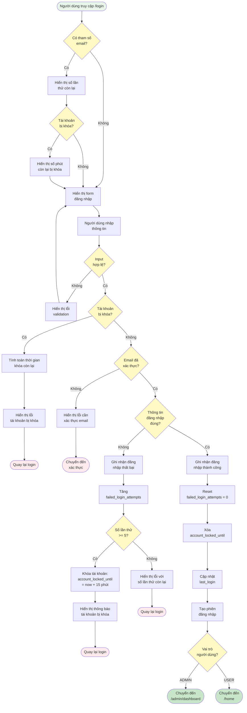

---

### 1.2. Đăng Ký Với Xác Thực Email

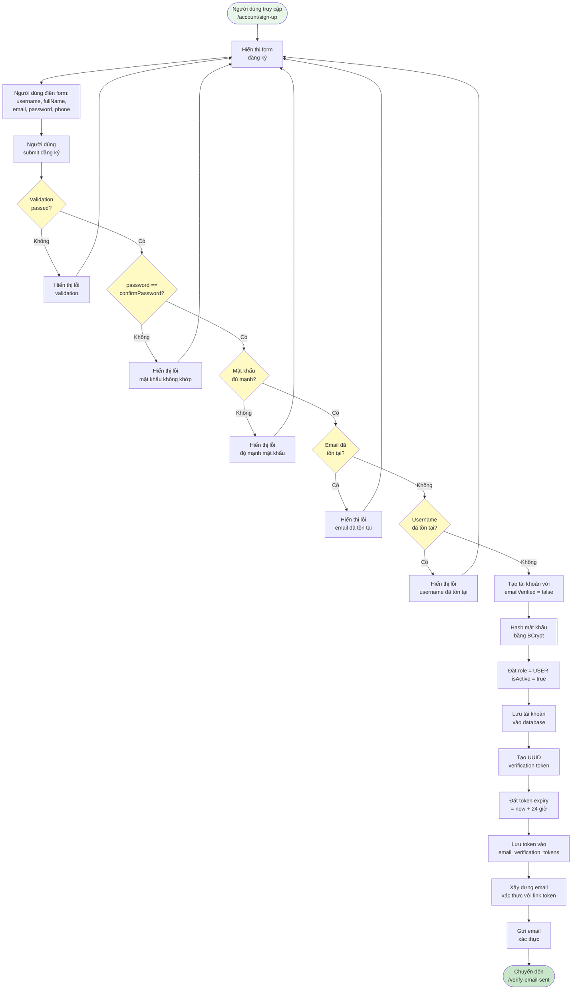

---

### 1.3. Đăng Nhập OAuth2 (Facebook/Google)

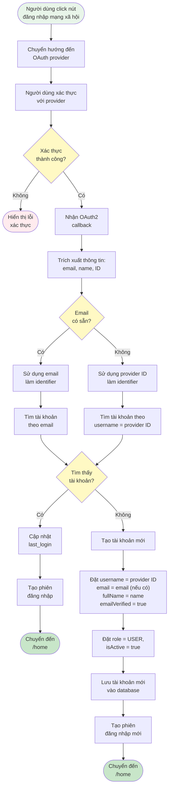

---

## 2. XÁC THỰC EMAIL

### 2.1. Xác Thực Email Từ Link

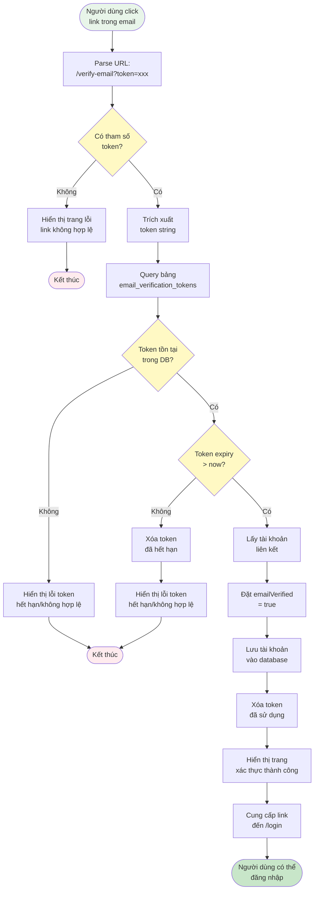

---

### 2.2. Gửi Lại Email Xác Thực

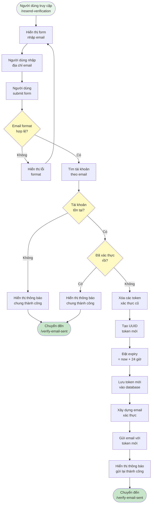

---

## 3. ĐẶT LẠI MẬT KHẨU

### 3.1. Yêu Cầu Quên Mật Khẩu

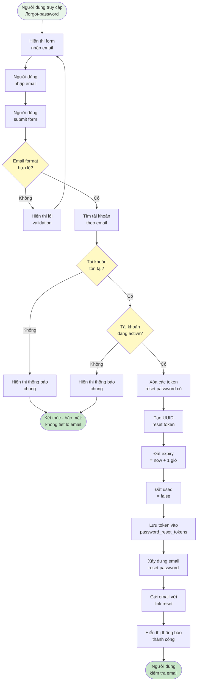

---

### 3.2. Đặt Lại Mật Khẩu Với Token

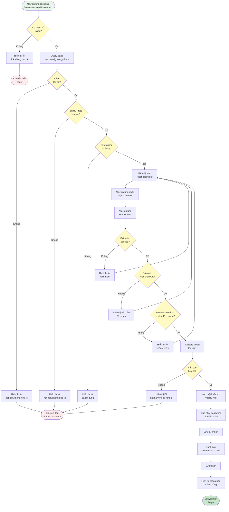

---

## 4. QUẢN LÝ TÀI KHOẢN

### 4.1. Xem Thông Tin Cá Nhân

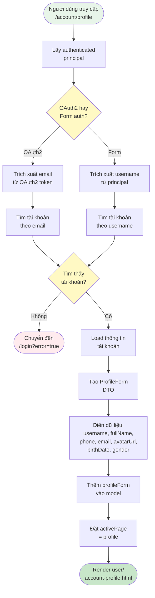

---

### 4.2. Cập Nhật Thông Tin Cá Nhân Với Avatar

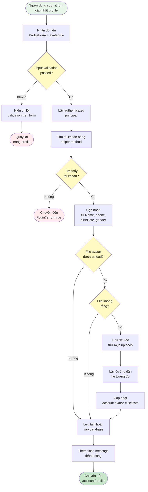

---

## 5. QUẢN LÝ ADMIN

### 5.1. Truy Cập Admin Dashboard

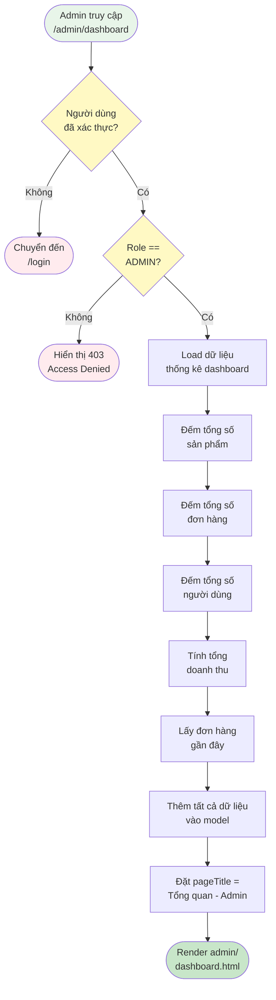

---

### 5.2. Quản Lý Sản Phẩm

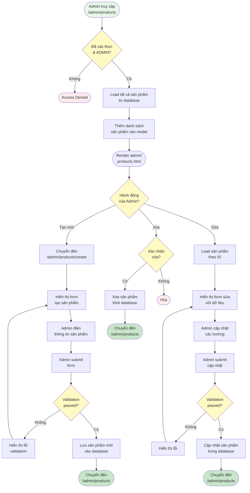

---

### 5.3. Quản Lý Đơn Hàng & Tài Khoản

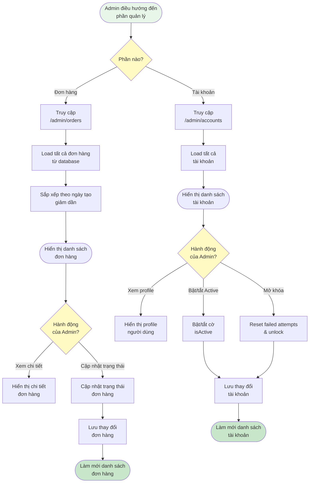

---

## 6. MUA SẮM

### 6.1. Duyệt Sản Phẩm & Xem Chi Tiết

```mermaid
flowchart TD
    Start([Người dùng truy cập<br/>/products])
    Start --> LoadProd[Load sản phẩm<br/>từ database]
    LoadProd --> CheckFilter{Có áp dụng<br/>bộ lọc?}
    CheckFilter -->|Có| FilterCat[Lọc theo<br/>danh mục]
    FilterCat --> FilterPrice[Lọc theo<br/>khoảng giá]
    FilterPrice --> FilterSearch[Lọc theo từ khóa<br/>tìm kiếm]
    FilterSearch --> SortResult[Sắp xếp<br/>kết quả]
    CheckFilter -->|Không| SortResult
    SortResult --> Paginate[Phân trang<br/>kết quả]
    Paginate --> DisplayGrid([Hiển thị lưới<br/>sản phẩm])
    
    DisplayGrid --> UserClick{Người dùng<br/>click sản phẩm?}
    UserClick -->|Có| NavDetail[Điều hướng đến<br/>/product/{id}]
    UserClick -->|Không| Browse[Tiếp tục duyệt]
    
    NavDetail --> LoadDetail[Load sản phẩm<br/>theo ID]
    LoadDetail --> ProdExists{Sản phẩm<br/>tồn tại?}
    ProdExists -->|Không| End1([Hiển thị<br/>404 error])
    ProdExists -->|Có| LoadImages[Load hình ảnh<br/>sản phẩm]
    LoadImages --> LoadReviews[Load đánh giá<br/>sản phẩm]
    LoadReviews --> LoadRelated[Load sản phẩm<br/>liên quan]
    LoadRelated --> DisplayDetail([Hiển thị trang<br/>chi tiết sản phẩm])
    DisplayDetail --> DetailAction{Hành động<br/>người dùng?}
    DetailAction -->|Thêm vào giỏ| AddCart[Thêm vào<br/>giỏ hàng]
    DetailAction -->|Xem sản phẩm khác| NavDetail
    DetailAction -->|Quay lại| DisplayGrid
    
    style Start fill:#E8F5E9
    style End1 fill:#FFEBEE
    style CheckFilter fill:#FFF9C4
    style UserClick fill:#FFF9C4
    style ProdExists fill:#FFF9C4
    style DetailAction fill:#FFF9C4
```

---

### 6.2. Giỏ Hàng & Thanh Toán

```mermaid
flowchart TD
    Start([Người dùng thêm<br/>sản phẩm vào giỏ])
    Start --> CheckSession{Session người dùng<br/>tồn tại?}
    CheckSession -->|Không| CreateSession[Tạo session<br/>mới]
    CheckSession -->|Có| GetCart[Lấy giỏ hàng<br/>từ session]
    CreateSession --> InitCart[Khởi tạo giỏ hàng<br/>rỗng]
    
    GetCart --> CheckProd{Sản phẩm đã có<br/>trong giỏ?}
    InitCart --> CheckProd
    CheckProd -->|Có| UpdateQty[Cập nhật<br/>số lượng]
    CheckProd -->|Không| AddNew[Thêm item mới<br/>vào giỏ]
    UpdateQty --> RecalcTotal[Tính lại tổng<br/>giỏ hàng]
    AddNew --> RecalcTotal
    RecalcTotal --> SaveCart[Lưu giỏ hàng<br/>vào session]
    SaveCart --> UpdateBadge[Cập nhật badge<br/>số lượng giỏ hàng]
    
    UpdateBadge --> UserNav{Người dùng<br/>điều hướng đến?}
    UserNav -->|Xem giỏ| NavCart[Điều hướng<br/>đến /cart]
    UserNav -->|Tiếp tục mua| End1([Quay lại<br/>sản phẩm])
    
    NavCart --> ShowCart[Hiển thị tất cả<br/>item trong giỏ]
    ShowCart --> CartAction{Hành động<br/>trong giỏ?}
    CartAction -->|Cập nhật SL| UpdateItem[Cập nhật số lượng<br/>item]
    UpdateItem --> RecalcTotal
    CartAction -->|Xóa item| RemoveItem[Xóa item<br/>khỏi giỏ]
    RemoveItem --> RecalcTotal
    CartAction -->|Thanh toán| CheckAuth{Người dùng<br/>đã xác thực?}
    
    CheckAuth -->|Không| End2([Chuyển đến<br/>/login])
    CheckAuth -->|Có| NavCheckout[Điều hướng<br/>đến /checkout]
    NavCheckout --> LoadAddr[Load địa chỉ<br/>người dùng]
    LoadAddr --> ShowCheckout([Hiển thị form<br/>checkout])
    ShowCheckout --> SubmitOrder[Người dùng submit<br/>đơn hàng]
    SubmitOrder --> ValidOrder{Validation<br/>passed?}
    ValidOrder -->|Không| ShowErr[Hiển thị lỗi<br/>validation]
    ShowErr --> ShowCheckout
    
    ValidOrder -->|Có| CreateOrder[Tạo đơn hàng<br/>trong database]
    CreateOrder --> ClearCart[Xóa giỏ hàng<br/>khỏi session]
    ClearCart --> SendEmail[Gửi email xác nhận<br/>đơn hàng]
    SendEmail --> End3([Hiển thị trang<br/>thành công đơn hàng])
    
    style Start fill:#E8F5E9
    style End1 fill:#C8E6C9
    style End2 fill:#FFEBEE
    style End3 fill:#C8E6C9
    style CheckSession fill:#FFF9C4
    style CheckProd fill:#FFF9C4
    style UserNav fill:#FFF9C4
    style CartAction fill:#FFF9C4
    style CheckAuth fill:#FFF9C4
    style ValidOrder fill:#FFF9C4
```

---

## 7. QUẢN LÝ DANH MỤC (CRUD)

### 7.1. Quản Lý Danh Mục - CRUD Đầy Đủ

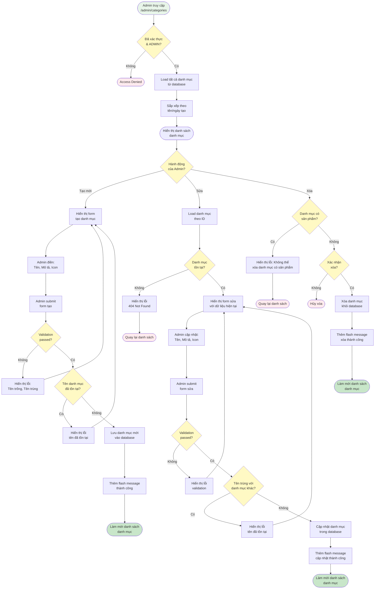

---

## 8. QUẢN LÝ SẢN PHẨM CHI TIẾT

### 8.1. Tạo/Sửa Sản Phẩm Với Upload Hình Ảnh

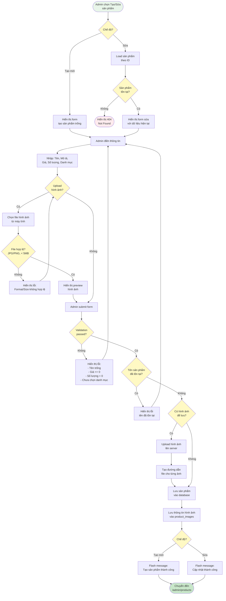

---

## 9. TÌM KIẾM & LỌC SẢN PHẨM

### 9.1. Tìm Kiếm Sản Phẩm Nâng Cao

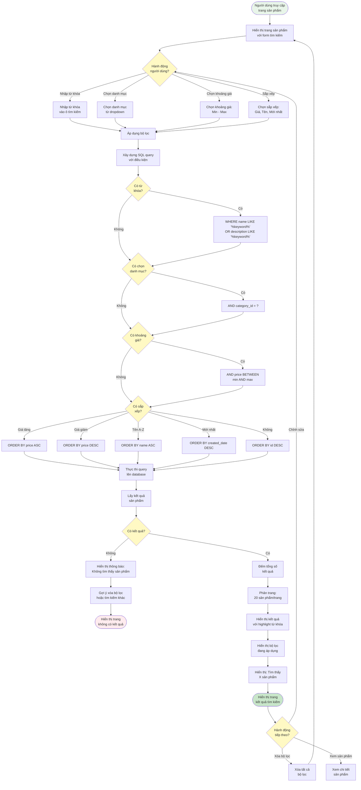

---

## 10. ĐÁNH GIÁ SẢN PHẨM

### 10.1. Người Dùng Đánh Giá Sản Phẩm

```mermaid
flowchart TD
    Start([Người dùng truy cập<br/>trang chi tiết sản phẩm])
    Start --> LoadProduct[Load thông tin<br/>sản phẩm]
    LoadProduct --> LoadReviews[Load tất cả đánh giá<br/>của sản phẩm]
    LoadReviews --> CalcAvg[Tính điểm trung bình<br/>và tổng số đánh giá]
    CalcAvg --> DisplayProduct[Hiển thị sản phẩm<br/>với đánh giá]
    
    DisplayProduct --> CheckAuth{Người dùng<br/>đã đăng nhập?}
    CheckAuth -->|Không| ShowLoginPrompt[Hiển thị: Đăng nhập<br/>để đánh giá]
    ShowLoginPrompt --> End1([Chỉ xem đánh giá])
    
    CheckAuth -->|Có| CheckPurchased{Đã mua<br/>sản phẩm này?}
    CheckPurchased -->|Không| ShowPurchaseReq[Hiển thị: Cần mua<br/>sản phẩm để đánh giá]
    ShowPurchaseReq --> End2([Chỉ xem đánh giá])
    
    CheckPurchased -->|Có| CheckReviewed{Đã đánh giá<br/>rồi?}
    CheckReviewed -->|Có| ShowEditOption[Hiển thị nút<br/>Sửa đánh giá]
    ShowEditOption --> UserChoose{Người dùng<br/>chọn?}
    UserChoose -->|Xem thôi| End3([Xem đánh giá])
    UserChoose -->|Sửa| LoadOldReview[Load đánh giá<br/>cũ của user]
    LoadOldReview --> ShowReviewForm
    
    CheckReviewed -->|Không| ShowReviewBtn[Hiển thị nút<br/>Viết đánh giá]
    ShowReviewBtn --> UserClick[Người dùng click<br/>Viết đánh giá]
    UserClick --> ShowReviewForm[Hiển thị form<br/>đánh giá]
    
    ShowReviewForm --> SelectRating[Chọn số sao:<br/>1-5 sao]
    SelectRating --> WriteComment[Viết nhận xét<br/>về sản phẩm]
    WriteComment --> UploadPhotos{Upload ảnh<br/>sản phẩm?}
    UploadPhotos -->|Có| SelectPhotos[Chọn ảnh<br/>tối đa 5 ảnh]
    SelectPhotos --> ValidatePhotos{Ảnh hợp lệ?<br/>JPG/PNG, < 2MB}
    ValidatePhotos -->|Không| ShowPhotoErr[Hiển thị lỗi<br/>ảnh không hợp lệ]
    ShowPhotoErr --> UploadPhotos
    ValidatePhotos -->|Có| PreviewPhotos[Preview ảnh<br/>đã chọn]
    PreviewPhotos --> SubmitReview[Người dùng submit<br/>đánh giá]
    UploadPhotos -->|Không| SubmitReview
    
    SubmitReview --> ValidateReview{Validation<br/>passed?}
    ValidateReview -->|Không| ShowReviewErr["Hiển thị lỗi:<br/>- Chưa chọn sao<br/>- Nhận xét quá ngắn"]
    ShowReviewErr --> ShowReviewForm
    
    ValidateReview -->|Có| SavePhotos{Có ảnh<br/>để lưu?}
    SavePhotos -->|Có| UploadToServer[Upload ảnh<br/>lên server]
    UploadToServer --> SaveReview[Lưu đánh giá<br/>vào database]
    SavePhotos -->|Không| SaveReview
    
    SaveReview --> SavePhotoRecords[Lưu thông tin ảnh<br/>vào review_images]
    SavePhotoRecords --> UpdateAvgRating[Cập nhật điểm TB<br/>của sản phẩm]
    UpdateAvgRating --> SendNotif[Gửi thông báo<br/>cho admin/seller]
    SendNotif --> ShowSuccess[Hiển thị thông báo<br/>đánh giá thành công]
    ShowSuccess --> End4([Làm mới trang<br/>sản phẩm])
    
    style Start fill:#E8F5E9
    style End1 fill:#FFEBEE
    style End2 fill:#FFEBEE
    style End3 fill:#C8E6C9
    style End4 fill:#C8E6C9
    style CheckAuth fill:#FFF9C4
    style CheckPurchased fill:#FFF9C4
    style CheckReviewed fill:#FFF9C4
    style UserChoose fill:#FFF9C4
    style UploadPhotos fill:#FFF9C4
    style ValidatePhotos fill:#FFF9C4
    style ValidateReview fill:#FFF9C4
    style SavePhotos fill:#FFF9C4
```

---

## 11. XỬ LÝ THANH TOÁN

### 11.1. Quy Trình Thanh Toán Đơn Hàng

```mermaid
flowchart TD
    Start([Người dùng click<br/>Thanh toán])
    Start --> CheckAuth{Đã đăng<br/>nhập?}
    CheckAuth -->|Không| End1([Chuyển đến<br/>/login])
    
    CheckAuth -->|Có| CheckCart{Giỏ hàng<br/>có sản phẩm?}
    CheckCart -->|Không| ShowEmptyCart[Hiển thị: Giỏ hàng<br/>trống]
    ShowEmptyCart --> End2([Quay lại<br/>trang sản phẩm])
    
    CheckCart -->|Có| LoadUserInfo[Load thông tin<br/>người dùng]
    LoadUserInfo --> ShowCheckoutForm[Hiển thị form<br/>thanh toán]
    ShowCheckoutForm --> FillInfo["Điền/Xác nhận:<br/>- Họ tên<br/>- Số điện thoại<br/>- Địa chỉ giao hàng"]
    FillInfo --> SelectPayment{Chọn phương thức<br/>thanh toán?}
    
    SelectPayment -->|COD| SelectCOD[Thanh toán khi<br/>nhận hàng - COD]
    SelectPayment -->|VNPay| SelectVNPay[Thanh toán online<br/>qua VNPay]
    SelectPayment -->|MoMo| SelectMoMo[Thanh toán online<br/>qua MoMo]
    
    SelectCOD --> AddNote[Thêm ghi chú<br/>đơn hàng - tùy chọn]
    SelectVNPay --> AddNote
    SelectMoMo --> AddNote
    
    AddNote --> ReviewOrder[Xem lại đơn hàng:<br/>Sản phẩm, Số lượng,<br/>Tổng tiền]
    ReviewOrder --> ConfirmOrder{Xác nhận<br/>đặt hàng?}
    ConfirmOrder -->|Không| End3([Hủy thanh toán])
    
    ConfirmOrder -->|Có| ValidateForm{Validation<br/>passed?}
    ValidateForm -->|Không| ShowFormErr["Hiển thị lỗi:<br/>- Thiếu thông tin<br/>- SĐT không hợp lệ<br/>- Địa chỉ trống"]
    ShowFormErr --> ShowCheckoutForm
    
    ValidateForm -->|Có| CheckStock{Kiểm tra<br/>tồn kho?}
    CheckStock -->|Hết hàng| ShowStockErr[Hiển thị: Sản phẩm<br/>đã hết hàng]
    ShowStockErr --> End4([Quay lại<br/>giỏ hàng])
    
    CheckStock -->|Đủ hàng| CreateOrder[Tạo đơn hàng<br/>trong database]
    CreateOrder --> SaveOrderItems[Lưu chi tiết<br/>đơn hàng]
    SaveOrderItems --> UpdateStock[Trừ số lượng<br/>tồn kho]
    UpdateStock --> CheckPaymentMethod{Phương thức<br/>thanh toán?}
    
    CheckPaymentMethod -->|COD| SetStatusPending[Đặt status =<br/>PENDING]
    SetStatusPending --> ClearCart[Xóa giỏ hàng]
    ClearCart --> SendConfirmEmail[Gửi email<br/>xác nhận đơn hàng]
    SendConfirmEmail --> ShowSuccessCOD[Hiển thị: Đặt hàng<br/>thành công - COD]
    ShowSuccessCOD --> End5([Chuyển đến trang<br/>đơn hàng thành công])
    
    CheckPaymentMethod -->|VNPay/MoMo| SetStatusWaiting[Đặt status =<br/>WAITING_PAYMENT]
    SetStatusWaiting --> RedirectPayment[Chuyển hướng đến<br/>cổng thanh toán]
    RedirectPayment --> UserPay[Người dùng thanh toán<br/>trên cổng]
    UserPay --> PaymentCallback{Kết quả<br/>thanh toán?}
    
    PaymentCallback -->|Thành công| UpdateStatusPaid[Cập nhật status =<br/>PAID]
    UpdateStatusPaid --> ClearCart2[Xóa giỏ hàng]
    ClearCart2 --> SendConfirmEmail2[Gửi email xác nhận<br/>đã thanh toán]
    SendConfirmEmail2 --> ShowSuccessPaid[Hiển thị: Thanh toán<br/>thành công]
    ShowSuccessPaid --> End6([Chuyển đến trang<br/>đơn hàng thành công])
    
    PaymentCallback -->|Thất bại| UpdateStatusFailed[Cập nhật status =<br/>PAYMENT_FAILED]
    UpdateStatusFailed --> RestoreStock[Hoàn lại<br/>tồn kho]
    RestoreStock --> ShowPaymentErr[Hiển thị: Thanh toán<br/>thất bại]
    ShowPaymentErr --> End7([Quay lại<br/>trang thanh toán])
    
    style Start fill:#E8F5E9
    style End1 fill:#FFEBEE
    style End2 fill:#FFEBEE
    style End3 fill:#FFEBEE
    style End4 fill:#FFEBEE
    style End5 fill:#C8E6C9
    style End6 fill:#C8E6C9
    style End7 fill:#FFEBEE
    style CheckAuth fill:#FFF9C4
    style CheckCart fill:#FFF9C4
    style SelectPayment fill:#FFF9C4
    style ConfirmOrder fill:#FFF9C4
    style ValidateForm fill:#FFF9C4
    style CheckStock fill:#FFF9C4
    style CheckPaymentMethod fill:#FFF9C4
    style PaymentCallback fill:#FFF9C4
```

---

## 12. THEO DÕI ĐƠN HÀNG

### 12.1. Người Dùng Theo Dõi Trạng Thái Đơn Hàng

```mermaid
    flowchart TD
        Start([Người dùng truy cập<br/>/account/orders])
        Start --> CheckAuth{Đã đăng<br/>nhập?}
        CheckAuth -->|Không| End1([Chuyển đến<br/>/login])
        
        CheckAuth -->|Có| LoadOrders[Load tất cả đơn hàng<br/>của người dùng]
        LoadOrders --> SortOrders[Sắp xếp theo<br/>ngày tạo giảm dần]
        SortOrders --> CheckEmpty{Có đơn<br/>hàng?}
        CheckEmpty -->|Không| ShowEmpty[Hiển thị: Bạn chưa<br/>có đơn hàng nào]
        ShowEmpty --> SuggestShop[Gợi ý: Bắt đầu<br/>mua sắm]
        SuggestShop --> End2([Hiển thị trang<br/>đơn hàng trống])
        
        CheckEmpty -->|Có| GroupByStatus[Nhóm đơn hàng<br/>theo trạng thái]
        GroupByStatus --> DisplayTabs["Hiển thị tabs:<br/>- Tất cả<br/>- Chờ xác nhận<br/>- Đang giao<br/>- Đã giao<br/>- Đã hủy"]
        DisplayTabs --> ShowOrders[Hiển thị danh sách<br/>đơn hàng]
        
        ShowOrders --> UserAction{Hành động<br/>người dùng?}
        
        UserAction -->|Xem chi tiết| SelectOrder[Chọn đơn hàng<br/>để xem]
        SelectOrder --> LoadDetail[Load chi tiết<br/>đơn hàng]
        LoadDetail --> ShowDetail["Hiển thị:<br/>- Thông tin sản phẩm<br/>- Địa chỉ giao hàng<br/>- Phương thức thanh toán<br/>- Trạng thái hiện tại"]
        ShowDetail --> LoadTimeline[Load timeline<br/>trạng thái]
        LoadTimeline --> DisplayTimeline["Hiển thị timeline:<br/>1. Đã đặt hàng<br/>2. Đã xác nhận<br/>3. Đang giao<br/>4. Đã giao"]
        DisplayTimeline --> CheckStatus{Trạng thái<br/>đơn hàng?}
        
        CheckStatus -->|PENDING| ShowPendingActions[Hiển thị: Hủy đơn hàng]
        CheckStatus -->|CONFIRMED| ShowConfirmedActions[Hiển thị: Liên hệ shop]
        CheckStatus -->|SHIPPING| ShowShippingInfo[Hiển thị: Mã vận đơn,<br/>Theo dõi shipper]
        CheckStatus -->|DELIVERED| ShowDeliveredActions[Hiển thị: Đánh giá,<br/>Mua lại]
        CheckStatus -->|CANCELLED| ShowCancelledInfo[Hiển thị: Lý do hủy,<br/>Mua lại]
        
        ShowPendingActions --> ActionChoice{Chọn<br/>hành động?}
        ShowConfirmedActions --> ActionChoice
        ShowShippingInfo --> ActionChoice
        ShowDeliveredActions --> ActionChoice
        ShowCancelledInfo --> ActionChoice
        
        ActionChoice -->|Hủy đơn| ConfirmCancel{Xác nhận<br/>hủy?}
        ConfirmCancel -->|Không| End3([Quay lại<br/>chi tiết])
        ConfirmCancel -->|Có| EnterReason[Nhập lý do<br/>hủy đơn]
        EnterReason --> UpdateCancel[Cập nhật status =<br/>CANCELLED]
        UpdateCancel --> RestoreStock[Hoàn lại<br/>tồn kho]
        RestoreStock --> SendCancelNotif[Gửi thông báo<br/>cho admin]
        SendCancelNotif --> ShowCancelSuccess[Hiển thị: Đã hủy<br/>đơn hàng]
        ShowCancelSuccess --> End4([Làm mới danh sách<br/>đơn hàng])
        
        ActionChoice -->|Đánh giá| CheckReviewed{Đã đánh giá<br/>sản phẩm?}
        CheckReviewed -->|Có| ShowReviewed[Hiển thị: Đã đánh giá]
        ShowReviewed --> End5([Xem đánh giá])
        CheckReviewed -->|Không| RedirectReview[Chuyển đến trang<br/>đánh giá sản phẩm]
        RedirectReview --> End6([Viết đánh giá])
        
        ActionChoice -->|Mua lại| AddToCart[Thêm sản phẩm<br/>vào giỏ hàng]
        AddToCart --> ShowAddSuccess[Hiển thị: Đã thêm<br/>vào giỏ hàng]
        ShowAddSuccess --> End7([Chuyển đến<br/>giỏ hàng])
        
        ActionChoice -->|Theo dõi shipper| ShowMap[Hiển thị bản đồ<br/>vị trí shipper]
        ShowMap --> ShowETA[Hiển thị thời gian<br/>giao hàng dự kiến]
        ShowETA --> End8([Theo dõi<br/>real-time])
        
        UserAction -->|Lọc theo trạng thái| FilterStatus[Chọn tab<br/>trạng thái]
        FilterStatus --> ShowOrders
        
        style Start fill:#E8F5E9
        style End1 fill:#FFEBEE
        style End2 fill:#FFEBEE
        style End3 fill:#C8E6C9
        style End4 fill:#C8E6C9
        style End5 fill:#C8E6C9
        style End6 fill:#C8E6C9
        style End7 fill:#C8E6C9
        style End8 fill:#C8E6C9
        style CheckAuth fill:#FFF9C4
        style CheckEmpty fill:#FFF9C4
        style UserAction fill:#FFF9C4
        style CheckStatus fill:#FFF9C4
        style ActionChoice fill:#FFF9C4
        style ConfirmCancel fill:#FFF9C4
        style CheckReviewed fill:#FFF9C4
```

---

## 13. QUẢN LÝ NGƯỜI DÙNG (ADMIN)

### 13.1. Admin Quản Lý Tài Khoản Người Dùng

```mermaid
flowchart TD
    Start([Admin truy cập<br/>/admin/accounts])
    Start --> CheckAuth{Đã xác thực<br/>& ADMIN?}
    CheckAuth -->|Không| End1([Access Denied])
    
    CheckAuth -->|Có| LoadAccounts[Load tất cả<br/>tài khoản]
    LoadAccounts --> FilterRole{Lọc theo<br/>vai trò?}
    FilterRole -->|Tất cả| ShowAll[Hiển thị tất cả<br/>tài khoản]
    FilterRole -->|USER| ShowUsers[Hiển thị chỉ<br/>tài khoản USER]
    FilterRole -->|ADMIN| ShowAdmins[Hiển thị chỉ<br/>tài khoản ADMIN]
    
    ShowAll --> SortAccounts[Sắp xếp theo<br/>ngày tạo/tên]
    ShowUsers --> SortAccounts
    ShowAdmins --> SortAccounts
    
    SortAccounts --> DisplayList["Hiển thị danh sách với:<br/>- Avatar<br/>- Tên, Email<br/>- Vai trò<br/>- Trạng thái Active<br/>- Ngày tạo"]
    
    DisplayList --> SearchBox[Hiển thị ô tìm kiếm:<br/>Tên, Email, SĐT]
    SearchBox --> AdminAction{Hành động<br/>của Admin?}
    
    AdminAction -->|Tìm kiếm| EnterSearch[Nhập từ khóa<br/>tìm kiếm]
    EnterSearch --> SearchDB[Tìm trong database<br/>theo tên/email/phone]
    SearchDB --> ShowResults[Hiển thị kết quả<br/>tìm kiếm]
    ShowResults --> AdminAction
    
    AdminAction -->|Xem chi tiết| SelectUser[Chọn tài khoản<br/>để xem]
    SelectUser --> LoadUserDetail[Load thông tin<br/>chi tiết]
    LoadUserDetail --> ShowUserInfo["Hiển thị:<br/>- Thông tin cá nhân<br/>- Lịch sử đơn hàng<br/>- Số lần đăng nhập thất bại<br/>- Thời gian khóa (nếu có)"]
    ShowUserInfo --> DetailAction{Hành động<br/>chi tiết?}
    
    DetailAction -->|Quay lại| DisplayList
    DetailAction -->|Sửa| EditUser
    DetailAction -->|Khóa/Mở khóa| ToggleActive
    DetailAction -->|Reset mật khẩu| ResetPassword
    
    AdminAction -->|Sửa thông tin| EditUser[Load form sửa<br/>thông tin]
    EditUser --> UpdateFields["Cập nhật:<br/>- Họ tên<br/>- Số điện thoại<br/>- Vai trò<br/>- Trạng thái"]
    UpdateFields --> ValidateEdit{Validation<br/>passed?}
    ValidateEdit -->|Không| ShowEditErr[Hiển thị lỗi<br/>validation]
    ShowEditErr --> EditUser
    ValidateEdit -->|Có| SaveChanges[Lưu thay đổi<br/>vào database]
    SaveChanges --> LogAction1[Ghi log: Admin sửa<br/>thông tin user]
    LogAction1 --> ShowEditSuccess[Hiển thị: Cập nhật<br/>thành công]
    ShowEditSuccess --> End2([Làm mới danh sách])
    
    AdminAction -->|Khóa/Mở khóa| ToggleActive{Trạng thái<br/>hiện tại?}
    ToggleActive -->|Active| ConfirmDeactivate{Xác nhận<br/>khóa tài khoản?}
    ConfirmDeactivate -->|Không| End3([Hủy])
    ConfirmDeactivate -->|Có| SetInactive[Đặt isActive<br/>= false]
    SetInactive --> LogoutUser[Đăng xuất user<br/>khỏi hệ thống]
    LogoutUser --> LogAction2[Ghi log: Admin khóa<br/>tài khoản]
    LogAction2 --> SendNotif1[Gửi email thông báo<br/>cho user]
    SendNotif1 --> ShowDeactivateSuccess[Hiển thị: Đã khóa<br/>tài khoản]
    ShowDeactivateSuccess --> End4([Làm mới danh sách])
    
    ToggleActive -->|Inactive| ConfirmActivate{Xác nhận<br/>mở khóa?}
    ConfirmActivate -->|Không| End5([Hủy])
    ConfirmActivate -->|Có| SetActive[Đặt isActive<br/>= true]
    SetActive --> ResetAttempts[Reset failed_login_attempts<br/>= 0]
    ResetAttempts --> ClearLock[Xóa account_locked_until]
    ClearLock --> LogAction3[Ghi log: Admin mở khóa<br/>tài khoản]
    LogAction3 --> SendNotif2[Gửi email thông báo<br/>cho user]
    SendNotif2 --> ShowActivateSuccess[Hiển thị: Đã mở khóa<br/>tài khoản]
    ShowActivateSuccess --> End6([Làm mới danh sách])
    
    AdminAction -->|Reset mật khẩu| ResetPassword[Tạo mật khẩu<br/>tạm thời]
    ResetPassword --> HashTempPass[Hash mật khẩu<br/>tạm thời]
    HashTempPass --> UpdatePassword[Cập nhật password<br/>trong database]
    UpdatePassword --> SetForceChange[Đặt cờ: Bắt buộc<br/>đổi mật khẩu]
    SetForceChange --> LogAction4[Ghi log: Admin reset<br/>mật khẩu]
    LogAction4 --> SendTempPass[Gửi email mật khẩu<br/>tạm thời cho user]
    SendTempPass --> ShowResetSuccess[Hiển thị: Đã reset<br/>mật khẩu]
    ShowResetSuccess --> End7([Làm mới danh sách])
    
    AdminAction -->|Xóa tài khoản| ConfirmDelete{Xác nhận<br/>xóa?}
    ConfirmDelete -->|Không| End8([Hủy])
    ConfirmDelete -->|Có| CheckOrders{Tài khoản có<br/>đơn hàng?}
    CheckOrders -->|Có| ShowDeleteErr[Hiển thị lỗi: Không thể<br/>xóa tài khoản có đơn hàng]
    ShowDeleteErr --> SuggestDeactivate[Gợi ý: Khóa tài khoản<br/>thay vì xóa]
    SuggestDeactivate --> End9([Quay lại])
    
    CheckOrders -->|Không| DeleteAccount[Xóa tài khoản<br/>khỏi database]
    DeleteAccount --> DeleteRelated[Xóa dữ liệu liên quan:<br/>Reviews, Tokens]
    DeleteRelated --> LogAction5[Ghi log: Admin xóa<br/>tài khoản]
    LogAction5 --> ShowDeleteSuccess[Hiển thị: Đã xóa<br/>tài khoản]
    ShowDeleteSuccess --> End10([Làm mới danh sách])
    
    style Start fill:#E8F5E9
    style End1 fill:#FFEBEE
    style End2 fill:#C8E6C9
    style End3 fill:#FFEBEE
    style End4 fill:#C8E6C9
    style End5 fill:#FFEBEE
    style End6 fill:#C8E6C9
    style End7 fill:#C8E6C9
    style End8 fill:#FFEBEE
    style End9 fill:#FFEBEE
    style End10 fill:#C8E6C9
    style CheckAuth fill:#FFF9C4
    style FilterRole fill:#FFF9C4
    style AdminAction fill:#FFF9C4
    style DetailAction fill:#FFF9C4
    style ValidateEdit fill:#FFF9C4
    style ToggleActive fill:#FFF9C4
    style ConfirmDeactivate fill:#FFF9C4
    style ConfirmActivate fill:#FFF9C4
    style ConfirmDelete fill:#FFF9C4
    style CheckOrders fill:#FFF9C4
```

---

## HƯỚNG DẪN SỬ DỤNG

### Bước 1: Copy Code Mermaid
- Chọn một diagram bất kỳ ở trên
- Copy toàn bộ code trong khối ```mermaid ... ```

### Bước 2: Render Trên Mermaid Live
1. Truy cập https://mermaid.live/
2. Paste code vào editor bên trái
3. Diagram sẽ tự động hiển thị bên phải

### Bước 3: Export
- Click nút "Actions" ở góc trên bên phải
- Chọn "Download SVG" hoặc "Download PNG"
- Lưu file về máy

### Bước 4: Import Vào Draw.io
1. Mở https://app.diagrams.net/
2. File → Import → chọn file SVG vừa download
3. Chỉnh sửa nếu cần (màu sắc, vị trí, text)
4. File → Save as → chọn .drawio để lưu

### Lưu Ý
- Mermaid Live có thể bị giới hạn kích thước diagram
- Nếu diagram quá lớn, có thể chia nhỏ thành nhiều phần
- SVG import vào Draw.io có thể cần điều chỉnh layout
- Màu sắc đã được set sẵn trong code Mermaid

---

## TÓM TẮT

Tài liệu này chứa **20 Activity Diagrams** hoàn chỉnh bằng tiếng Việt:

### Nhóm 1: Xác Thực & Bảo Mật (3 diagrams)
✅ Đăng nhập với giới hạn số lần thử  
✅ Đăng ký với xác thực email  
✅ Đăng nhập OAuth2 (Facebook/Google)

### Nhóm 2: Email Verification (2 diagrams)
✅ Xác thực email từ link  
✅ Gửi lại email xác thực

### Nhóm 3: Password Reset (2 diagrams)
✅ Yêu cầu quên mật khẩu  
✅ Đặt lại mật khẩu với token

### Nhóm 4: Account Management (2 diagrams)
✅ Xem thông tin cá nhân  
✅ Cập nhật thông tin với avatar

### Nhóm 5: Admin Management (4 diagrams)
✅ Truy cập dashboard  
✅ Quản lý sản phẩm (CRUD cơ bản)  
✅ Quản lý đơn hàng & tài khoản (cơ bản)  
✅ **Quản lý người dùng** (CRUD chi tiết) - MỚI!

### Nhóm 6: Shopping (2 diagrams)
✅ Duyệt sản phẩm & xem chi tiết  
✅ Giỏ hàng & thanh toán (cơ bản)

### Nhóm 7: CRUD Chi Tiết & Tính Năng Nâng Cao (5 diagrams - MỚI!)
✅ **Quản lý danh mục** (CRUD đầy đủ)  
✅ **Quản lý sản phẩm** với upload hình ảnh  
✅ **Tìm kiếm & lọc** sản phẩm nâng cao  
✅ **Đánh giá sản phẩm** với upload ảnh  
✅ **Xử lý thanh toán** (COD, VNPay, MoMo)  
✅ **Theo dõi đơn hàng** với timeline trạng thái

---

**📊 Tổng cộng: 20 Activity Diagrams**

**⏱️ Thời gian ước tính**: 6-8 giờ để vẽ hoàn chỉnh tất cả các diagrams.

**💡 Lưu ý**: Bạn có thể vẽ từng diagram riêng lẻ hoặc gộp tất cả vào một file Draw.io với nhiều pages (tabs).

**🎯 Phù hợp cho**: Báo cáo đồ án tốt nghiệp Giai đoạn 1 - đầy đủ các chức năng CRUD và tính năng nâng cao!

Chúc bạn vẽ thành công! 🎨
