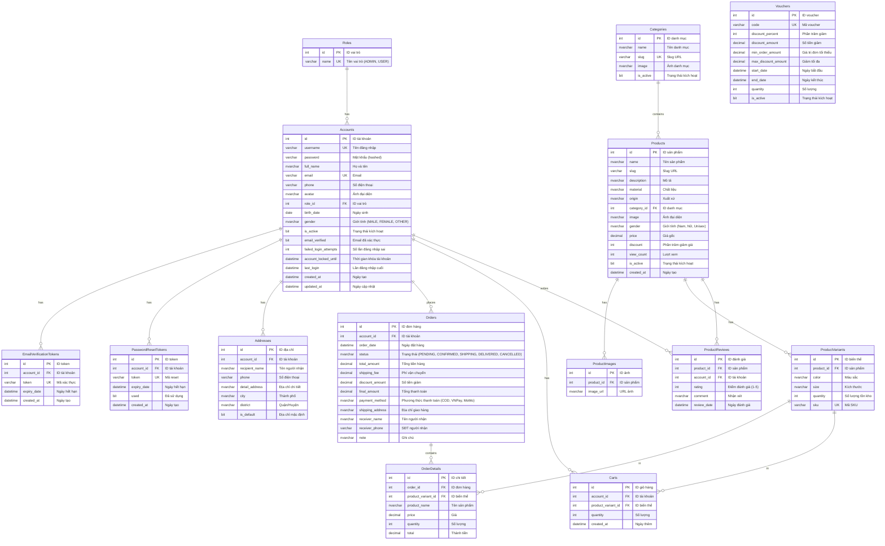

# SƠ ĐỒ QUAN HỆ THỰC THỂ (ERD) - DỰ ÁN SHOPOMG

## Tổng quan

Sơ đồ ERD mô tả cấu trúc cơ sở dữ liệu của hệ thống ShopOMG với **15 thực thể** và các mối quan hệ giữa chúng.

---

## Sơ đồ ERD (Mermaid Syntax)



---

## Danh sách Thực thể (15 Entities)

### **Nhóm 1: Xác thực & Tài khoản (5 entities)**

| **STT** | **Tên thực thể** | **Tên bảng** | **Mô tả** |
|---------|------------------|--------------|-----------|
| 1 | Roles | Roles | Vai trò người dùng (ADMIN, USER) |
| 2 | Accounts | Accounts | Tài khoản người dùng |
| 3 | EmailVerificationTokens | EmailVerificationTokens | Token xác thực email |
| 4 | PasswordResetTokens | PasswordResetTokens | Token đặt lại mật khẩu |
| 5 | Addresses | Addresses | Địa chỉ giao hàng |

### **Nhóm 2: Sản phẩm (5 entities)**

| **STT** | **Tên thực thể** | **Tên bảng** | **Mô tả** |
|---------|------------------|--------------|-----------|
| 6 | Categories | Categories | Danh mục sản phẩm |
| 7 | Products | Products | Sản phẩm |
| 8 | ProductImages | ProductImages | Ảnh sản phẩm |
| 9 | ProductVariants | ProductVariants | Biến thể sản phẩm (màu, size, tồn kho) |
| 10 | ProductReviews | ProductReviews | Đánh giá sản phẩm |

### **Nhóm 3: Đơn hàng & Giỏ hàng (3 entities)**

| **STT** | **Tên thực thể** | **Tên bảng** | **Mô tả** |
|---------|------------------|--------------|-----------|
| 11 | Orders | Orders | Đơn hàng |
| 12 | OrderDetails | OrderDetails | Chi tiết đơn hàng |
| 13 | Carts | Carts | Giỏ hàng |

### **Nhóm 4: Khuyến mãi (1 entity)**

| **STT** | **Tên thực thể** | **Tên bảng** | **Mô tả** |
|---------|------------------|--------------|-----------|
| 14 | Vouchers | Vouchers | Mã giảm giá |

### **Nhóm 5: Views & Stored Procedures (1 view)**

| **STT** | **Tên** | **Loại** | **Mô tả** |
|---------|---------|----------|-----------|
| 15 | v_DailyRevenue | View | Báo cáo doanh thu theo ngày |

---

## Mối quan hệ giữa các thực thể

### **Bảng tổng hợp các mối quan hệ**

| **STT** | **Thực thể 1** | **Mối quan hệ** | **Thực thể 2** | **Kiểu** | **Khóa ngoại** |
|---------|----------------|-----------------|----------------|----------|----------------|
| 1 | Roles | Có | Accounts | 1:N | Accounts.role_id → Roles.id |
| 2 | Accounts | Có | EmailVerificationTokens | 1:N | EmailVerificationTokens.account_id → Accounts.id |
| 3 | Accounts | Có | PasswordResetTokens | 1:N | PasswordResetTokens.account_id → Accounts.id |
| 4 | Accounts | Có | Addresses | 1:N | Addresses.account_id → Accounts.id |
| 5 | Accounts | Đặt | Orders | 1:N | Orders.account_id → Accounts.id |
| 6 | Accounts | Có | Carts | 1:N | Carts.account_id → Accounts.id |
| 7 | Accounts | Viết | ProductReviews | 1:N | ProductReviews.account_id → Accounts.id |
| 8 | Categories | Chứa | Products | 1:N | Products.category_id → Categories.id |
| 9 | Products | Có | ProductImages | 1:N | ProductImages.product_id → Products.id |
| 10 | Products | Có | ProductVariants | 1:N | ProductVariants.product_id → Products.id |
| 11 | Products | Có | ProductReviews | 1:N | ProductReviews.product_id → Products.id |
| 12 | Orders | Chứa | OrderDetails | 1:N | OrderDetails.order_id → Orders.id |
| 13 | ProductVariants | Trong | OrderDetails | 1:N | OrderDetails.product_variant_id → ProductVariants.id |
| 14 | ProductVariants | Trong | Carts | 1:N | Carts.product_variant_id → ProductVariants.id |

---

## Hướng dẫn vẽ ERD trên Draw.io với hình thoi

### **Bước 1: Tạo các thực thể (Entity)**

1. Mở Draw.io → Chọn template "Blank Diagram"
2. Từ thanh bên trái, kéo hình chữ nhật (Rectangle) vào canvas
3. Tạo 15 hình chữ nhật cho 15 thực thể
4. Đặt tên cho mỗi thực thể (ví dụ: "Accounts", "Products", "Orders"...)

### **Bước 2: Thêm thuộc tính vào thực thể**

1. Double-click vào hình chữ nhật
2. Nhập danh sách thuộc tính theo format:
```
Accounts
-----------------
id (PK)
username (UK)
password
full_name
email (UK)
phone
avatar
role_id (FK)
...
```

### **Bước 3: Vẽ mối quan hệ với hình thoi**

#### **Cách vẽ:**

1. **Tạo hình thoi:**
   - Từ thanh bên trái → Chọn "Diamond" (hình thoi)
   - Kéo vào giữa 2 thực thể cần liên kết

2. **Đặt tên mối quan hệ:**
   - Double-click vào hình thoi
   - Nhập tên mối quan hệ bằng tiếng Việt (ví dụ: "Có", "Đặt", "Chứa", "Viết"...)

3. **Nối các đường:**
   - Kéo đường từ **Thực thể 1** → **Hình thoi** (đầu 1)
   - Kéo đường từ **Hình thoi** → **Thực thể 2** (đầu N)

4. **Đánh dấu cardinality:**
   - Click vào đường nối
   - Thêm text "1" ở đầu Thực thể 1
   - Thêm text "N" hoặc "*" ở đầu Thực thể 2

---

### **Ví dụ cụ thể: Roles ↔ Accounts**

```
[Roles] ----1---- ◇ Có ◇ ----N---- [Accounts]
```

**Các bước:**
1. Vẽ hình chữ nhật "Roles" (bên trái)
2. Vẽ hình chữ nhật "Accounts" (bên phải)
3. Vẽ hình thoi ở giữa, ghi "Có"
4. Nối Roles → Hình thoi (ghi "1" ở đầu Roles)
5. Nối Hình thoi → Accounts (ghi "N" ở đầu Accounts)

---

### **Danh sách 14 mối quan hệ cần vẽ**

#### **Nhóm Tài khoản (7 mối quan hệ):**

1. **Roles → Accounts**
   - Hình thoi: "Có"
   - Kiểu: 1:N
   - Roles (1) → Có → Accounts (N)

2. **Accounts → EmailVerificationTokens**
   - Hình thoi: "Có"
   - Kiểu: 1:N
   - Accounts (1) → Có → EmailVerificationTokens (N)

3. **Accounts → PasswordResetTokens**
   - Hình thoi: "Có"
   - Kiểu: 1:N
   - Accounts (1) → Có → PasswordResetTokens (N)

4. **Accounts → Addresses**
   - Hình thoi: "Có"
   - Kiểu: 1:N
   - Accounts (1) → Có → Addresses (N)

5. **Accounts → Orders**
   - Hình thoi: "Đặt"
   - Kiểu: 1:N
   - Accounts (1) → Đặt → Orders (N)

6. **Accounts → Carts**
   - Hình thoi: "Có"
   - Kiểu: 1:N
   - Accounts (1) → Có → Carts (N)

7. **Accounts → ProductReviews**
   - Hình thoi: "Viết"
   - Kiểu: 1:N
   - Accounts (1) → Viết → ProductReviews (N)

#### **Nhóm Sản phẩm (4 mối quan hệ):**

8. **Categories → Products**
   - Hình thoi: "Chứa"
   - Kiểu: 1:N
   - Categories (1) → Chứa → Products (N)

9. **Products → ProductImages**
   - Hình thoi: "Có"
   - Kiểu: 1:N
   - Products (1) → Có → ProductImages (N)

10. **Products → ProductVariants**
    - Hình thoi: "Có"
    - Kiểu: 1:N
    - Products (1) → Có → ProductVariants (N)

11. **Products → ProductReviews**
    - Hình thoi: "Có"
    - Kiểu: 1:N
    - Products (1) → Có → ProductReviews (N)

#### **Nhóm Đơn hàng (3 mối quan hệ):**

12. **Orders → OrderDetails**
    - Hình thoi: "Chứa"
    - Kiểu: 1:N
    - Orders (1) → Chứa → OrderDetails (N)

13. **ProductVariants → OrderDetails**
    - Hình thoi: "Trong"
    - Kiểu: 1:N
    - ProductVariants (1) → Trong → OrderDetails (N)

14. **ProductVariants → Carts**
    - Hình thoi: "Trong"
    - Kiểu: 1:N
    - ProductVariants (1) → Trong → Carts (N)

---

### **Gợi ý Layout trên Draw.io**

```
                    [Roles]
                       |
                     (Có)
                       |
    [EmailVerificationTokens] ← (Có) ← [Accounts] → (Đặt) → [Orders] → (Chứa) → [OrderDetails]
                                           |                                           ↑
                                         (Có)                                      (Trong)
                                           |                                           |
                    [PasswordResetTokens]  |                                  [ProductVariants]
                                           |                                           |
                                         (Có)                                        (Có)
                                           |                                           |
                                      [Addresses]                                 [Products]
                                           |                                           |
                                         (Có)                                      (Chứa)
                                           |                                           |
                                        [Carts] ← (Trong) ← [ProductVariants]    [Categories]
                                           
                                      [ProductReviews] ← (Viết) ← [Accounts]
                                           ↑
                                         (Có)
                                           |
                                      [Products] → (Có) → [ProductImages]
```

---

### **Màu sắc đề xuất**

- **Thực thể (Entity):** Màu xanh nhạt (#E3F2FD)
- **Hình thoi (Relationship):** Màu vàng nhạt (#FFF9C4)
- **Đường nối:** Màu đen
- **Text cardinality (1, N):** Màu đỏ

---

### **Lưu ý quan trọng**

1. **Primary Key (PK):** Gạch chân hoặc in đậm
2. **Foreign Key (FK):** Đánh dấu (FK) sau tên thuộc tính
3. **Unique Key (UK):** Đánh dấu (UK) sau tên thuộc tính
4. **Cascade Delete:** Vẽ đường nối đậm hơn hoặc thêm chú thích "CASCADE"

---

**Chúc bạn vẽ ERD thành công! 🎨**

---

## Ràng buộc toàn vẹn (Constraints)

### **Primary Keys (PK)**
Tất cả 15 bảng đều có khóa chính `id` kiểu `INT IDENTITY(1,1)`

### **Unique Keys (UK)**
- `Roles.name`
- `Accounts.username`
- `Accounts.email`
- `EmailVerificationTokens.token`
- `PasswordResetTokens.token`
- `Categories.slug`
- `ProductVariants.sku`
- `Vouchers.code`

### **Check Constraints**
- `ProductVariants.quantity >= 0`
- `ProductReviews.rating BETWEEN 1 AND 5`
- `OrderDetails.quantity > 0`
- `Vouchers.discount_percent BETWEEN 0 AND 100`

### **Default Values**
- `Accounts.is_active = 1`
- `Accounts.email_verified = 0`
- `Accounts.failed_login_attempts = 0`
- `Categories.is_active = 1`
- `Products.is_active = 1`
- `Products.discount = 0`
- `Products.view_count = 0`
- `Orders.status = 'PENDING'`
- `Orders.payment_method = 'COD'`
- `PasswordResetTokens.used = 0`

---

## Indexes (Đề xuất)

### **Indexes cho hiệu năng**
```sql
-- Tìm kiếm tài khoản
CREATE INDEX idx_accounts_email ON Accounts(email);
CREATE INDEX idx_accounts_username ON Accounts(username);

-- Tìm kiếm sản phẩm
CREATE INDEX idx_products_category ON Products(category_id);
CREATE INDEX idx_products_slug ON Products(slug);
CREATE INDEX idx_products_gender ON Products(gender);

-- Giỏ hàng
CREATE INDEX idx_carts_account ON Carts(account_id);

-- Đơn hàng
CREATE INDEX idx_orders_account ON Orders(account_id);
CREATE INDEX idx_orders_status ON Orders(status);
CREATE INDEX idx_orders_date ON Orders(order_date);

-- Token
CREATE INDEX idx_email_tokens_account ON EmailVerificationTokens(account_id);
CREATE INDEX idx_password_tokens_account ON PasswordResetTokens(account_id);
```

---

## Ghi chú

- **Tổng số bảng:** 14 bảng + 1 view
- **Tổng số mối quan hệ:** 14 mối quan hệ
- **Cascade Delete:** 5 mối quan hệ (Addresses, ProductImages, ProductVariants, OrderDetails, Carts)
- **Nullable Foreign Keys:** 2 (Orders.account_id, OrderDetails.product_variant_id)

---

## Hướng dẫn sử dụng với Draw.io

### **Bước 1:** Copy code Mermaid
Copy toàn bộ code Mermaid từ phần "Sơ đồ ERD (Mermaid Syntax)" ở trên

### **Bước 2:** Render trên Mermaid Live
1. Truy cập https://mermaid.live/
2. Paste code vào editor
3. Xem preview ERD

### **Bước 3:** Export và Import vào Draw.io
1. Trên Mermaid Live, click "Actions" → "Download SVG" hoặc "Download PNG"
2. Mở Draw.io (https://app.diagrams.net/)
3. File → Import → Chọn file SVG/PNG vừa tải
4. Chỉnh sửa và lưu dưới định dạng `.drawio`

---

**Chúc bạn thành công với ERD! 🎨**
