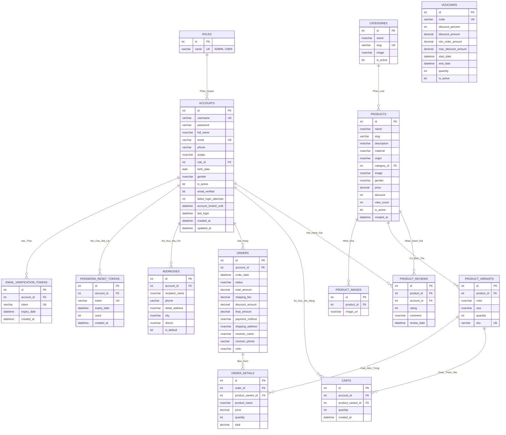

# ERD MERMAID - SHOPOMG (ĐẦY ĐỦ 14 MỐI QUAN HỆ)

## Code Mermaid ERD

---

## Giải thích ký hiệu Mermaid

### **Cardinality (Bản số):**
- `||--o{` : Quan hệ 1-to-Many (1:N)
  - `||` : Exactly one (1)
  - `o{` : Zero or more (N)

### **Tên mối quan hệ:**
- Sử dụng dấu `_` thay cho khoảng trắng
- Ví dụ: "Phân quyền" → `Phan_Quyen`

---

## Danh sách 14 mối quan hệ

| **STT** | **Thực thể 1** | **Mối quan hệ** | **Thực thể 2** | **Tên Mermaid** |
|---------|----------------|-----------------|----------------|-----------------|
| 1 | ROLES | Phân quyền | ACCOUNTS | `Phan_Quyen` |
| 2 | ACCOUNTS | Xác thực | EMAIL_VERIFICATION_TOKENS | `Xac_Thuc` |
| 3 | ACCOUNTS | Yêu cầu đặt lại | PASSWORD_RESET_TOKENS | `Yeu_Cau_Dat_Lai` |
| 4 | ACCOUNTS | Sở hữu địa chỉ | ADDRESSES | `So_Huu_Dia_Chi` |
| 5 | ACCOUNTS | Đặt hàng | ORDERS | `Dat_Hang` |
| 6 | ACCOUNTS | Sở hữu giỏ hàng | CARTS | `So_Huu_Gio_Hang` |
| 7 | ACCOUNTS | Viết đánh giá | PRODUCT_REVIEWS | `Viet_Danh_Gia` |
| 8 | CATEGORIES | Phân loại | PRODUCTS | `Phan_Loai` |
| 9 | PRODUCTS | Minh họa | PRODUCT_IMAGES | `Minh_Hoa` |
| 10 | PRODUCTS | Có biến thể | PRODUCT_VARIANTS | `Co_Bien_The` |
| 11 | PRODUCTS | Nhận đánh giá | PRODUCT_REVIEWS | `Nhan_Danh_Gia` |
| 12 | ORDERS | Bao gồm | ORDER_DETAILS | `Bao_Gom` |
| 13 | PRODUCT_VARIANTS | Xuất hiện trong | ORDER_DETAILS | `Xuat_Hien_Trong` |
| 14 | PRODUCT_VARIANTS | Được thêm vào | CARTS | `Duoc_Them_Vao` |

---

## Hướng dẫn sử dụng với Draw.io

### **Cách 1: Import trực tiếp (Nếu Draw.io hỗ trợ)**

1. Copy toàn bộ code Mermaid từ phần "Code Mermaid ERD" ở trên
2. Mở Draw.io → File → Import → From Text → Mermaid
3. Paste code → Import

### **Cách 2: Qua Mermaid Live (Khuyến nghị)**

1. Truy cập https://mermaid.live/
2. Paste code Mermaid vào editor
3. Xem preview ERD
4. Click "Actions" → "Download SVG" hoặc "Download PNG"
5. Mở Draw.io → File → Import → Chọn file SVG/PNG vừa tải
6. Chỉnh sửa và lưu

### **Cách 3: Vẽ thủ công theo hướng dẫn**

Sử dụng file `ERD_DRAWIO_GUIDE.md` để vẽ từng thực thể và mối quan hệ với hình thoi

---

## Lưu ý

- **Mermaid không hỗ trợ hình thoi (diamond)** cho mối quan hệ như ký hiệu Chen
- Nếu muốn có hình thoi, bạn cần vẽ thủ công trên Draw.io theo hướng dẫn trong file `ERD_DRAWIO_GUIDE.md`
- Code Mermaid này dùng để **xem nhanh cấu trúc** và **export ảnh** để tham khảo

---

**Chúc bạn thành công! 🎨**
