# Activity Diagrams - ShopOMG E-Commerce Project

This document contains comprehensive activity diagrams for all major features implemented in the ShopOMG Spring Boot application.

## Table of Contents

1. [Authentication Flows](#1-authentication-flows)
2. [Email Verification Flows](#2-email-verification-flows)
3. [Password Reset Flows](#3-password-reset-flows)
4. [Account Management Flows](#4-account-management-flows)
5. [Admin Management Flows](#5-admin-management-flows)
6. [Shopping Flows](#6-shopping-flows)

---

## 1. Authentication Flows

### 1.1 User Login with Attempt Limiting

This diagram shows the complete login flow including failed login tracking, account lockout after 5 failed attempts, and 15-minute automatic unlock.

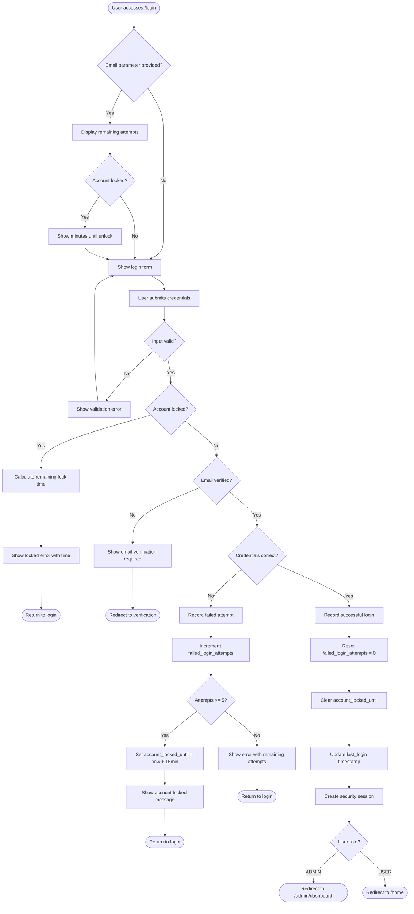

**Key Features:**
- Maximum 5 login attempts before lockout
- 15-minute automatic lock duration
- Real-time display of remaining attempts
- Email verification check
- Role-based redirection after successful login

---

### 1.2 User Registration with Email Verification

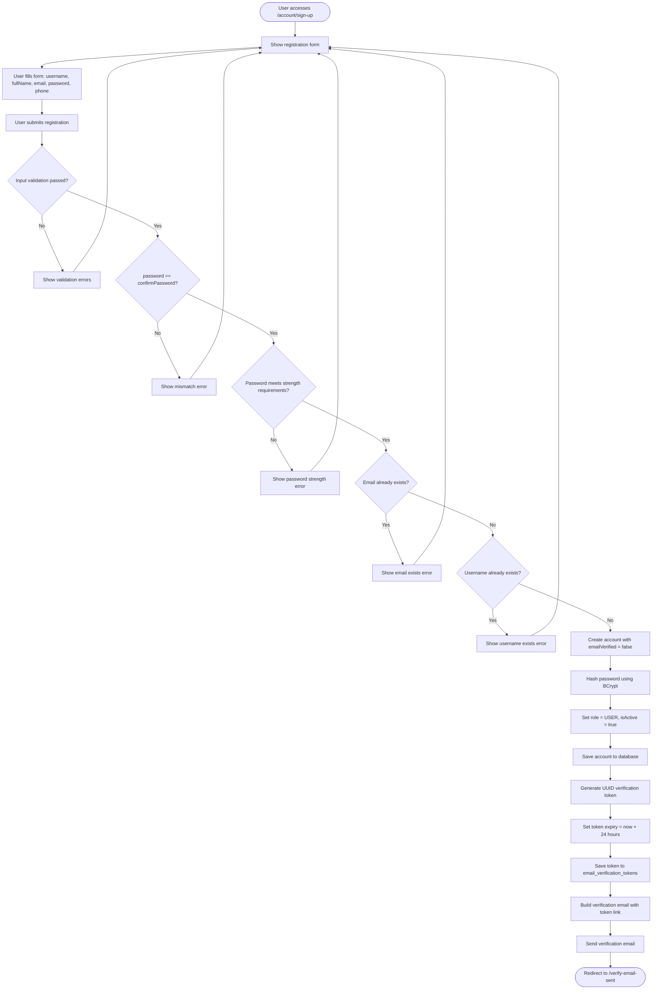

**Key Features:**
- Password strength validation (min 8 chars, uppercase, lowercase, number, special char)
- Email and username uniqueness checks
- BCrypt password hashing
- 24-hour verification token validity
- Professional email template with verification link

---

### 1.3 OAuth2 Social Login (Facebook/Google)

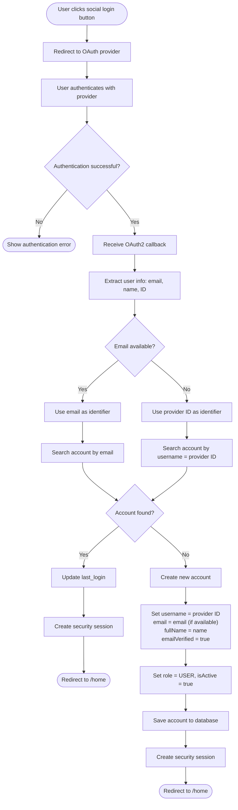

**Key Features:**
- Supports Facebook and Google OAuth2
- Auto-creates account for first-time OAuth users
- Auto-verifies email for OAuth accounts
- Seamless login for existing users
- Provider ID fallback when email not available

---

## 2. Email Verification Flows

### 2.1 Email Verification from Link

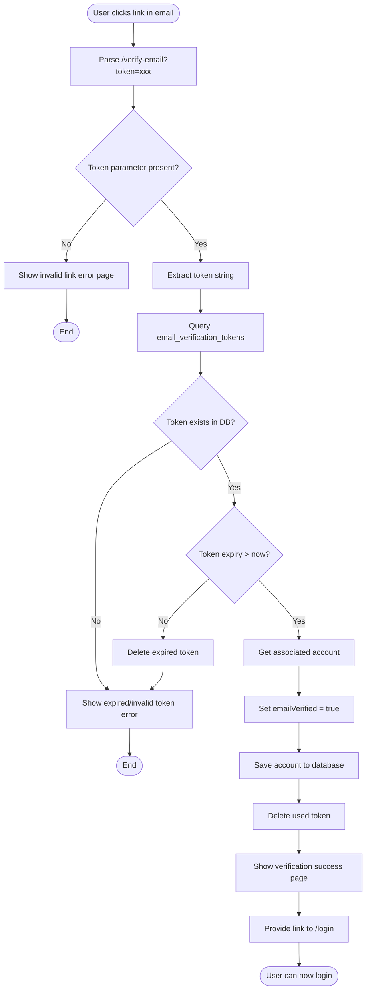

**Key Features:**
- Token validity check (24-hour expiration)
- One-time use tokens (deleted after verification)
- Clear error messages for expired/invalid tokens
- Immediate account activation upon verification

---

### 2.2 Resend Verification Email

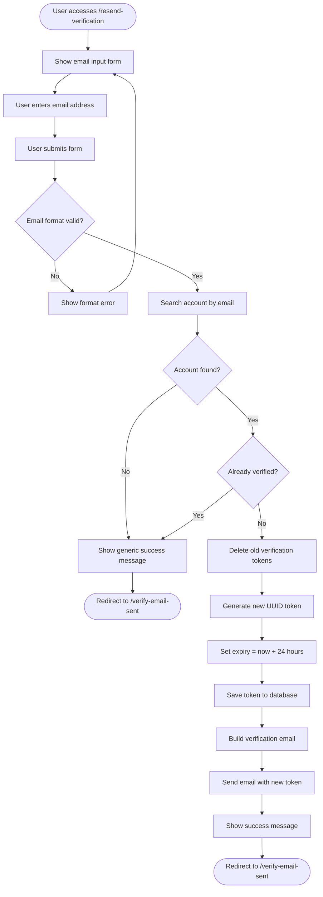

**Key Features:**
- Generic success message (security: no email enumeration)
- Old tokens cleanup before generating new one
- 24-hour validity for new token
- Same email template as initial registration

---

## 3. Password Reset Flows

### 3.1 Forgot Password Request

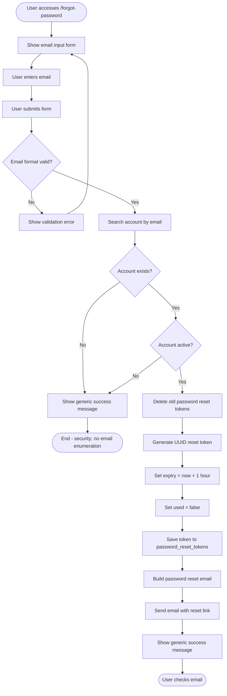

**Key Features:**
- Email enumeration protection (always shows success message)
- 1-hour token expiration
- Old tokens cleanup
- Professional HTML email template
- Secure token generation using UUID

---

### 3.2 Reset Password with Token

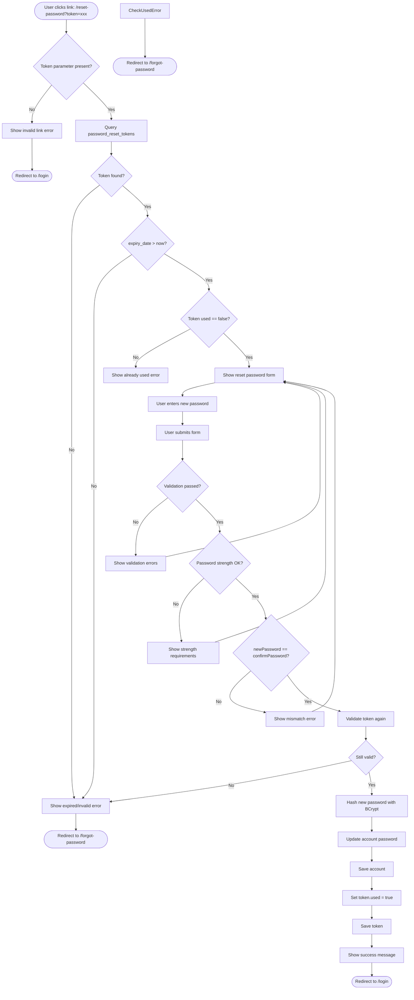

**Key Features:**
- Token validation (expiry, used flag)
- Password strength validation
- Re-validation before password change (prevent race conditions)
- BCrypt password hashing
- One-time token usage

---

## 4. Account Management Flows

### 4.1 View User Profile

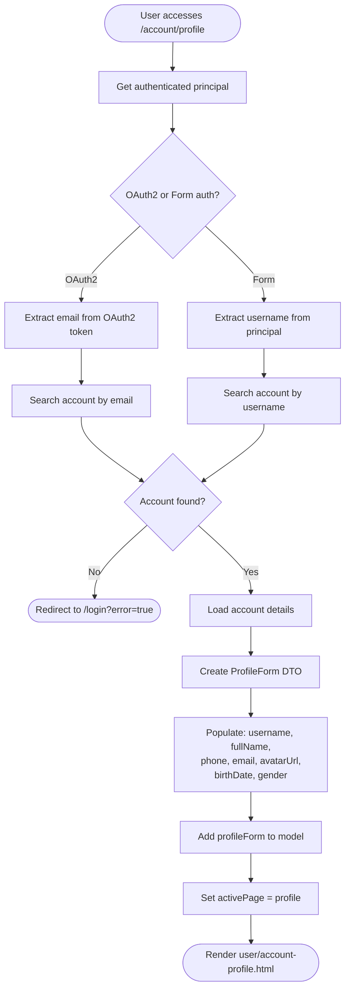

**Key Features:**
- Support for both Form and OAuth2 authentication
- Fallback search (email first, then username)
- Pre-populated form with current data
- Read-only email display

---

### 4.2 Update User Profile with Avatar

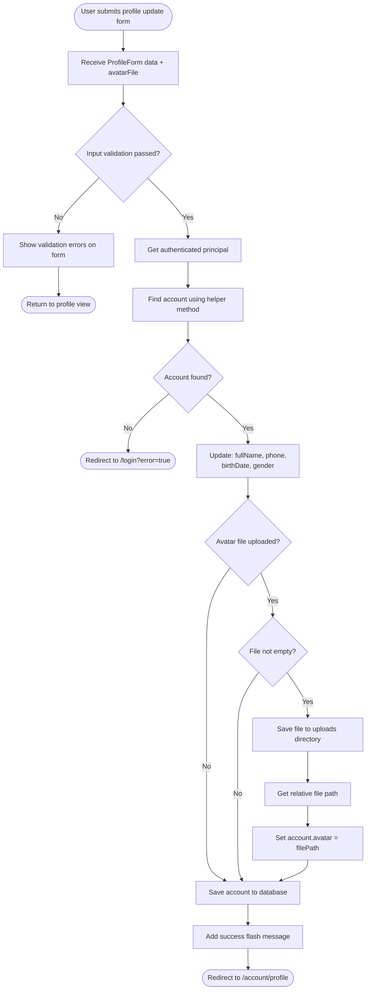

**Key Features:**
- Separate validation for form fields and file upload
- Optional avatar upload (doesn't overwrite if not provided)
- File storage in uploads directory
- Flash message for user feedback
- Transaction support for data consistency

---

## 5. Admin Management Flows

### 5.1 Admin Dashboard Access

```mermaid
flowchart TD
    Start([Admin accesses /admin/dashboard]) --> CheckAuth{User authenticated?}
    CheckAuth -->|No| RedirectLogin([Redirect to /login])
    CheckAuth -->|Yes| CheckRole{Role == ADMIN?}
    CheckRole -->|No| ShowAccessDenied([Show 403 Access Denied])
    CheckRole -->|Yes| LoadDashboardData[Load dashboard statistics]
    LoadDashboardData --> CountProducts[Count total products]
    CountProducts --> CountOrders[Count total orders]
    CountOrders --> CountUsers[Count total users]
    CountUsers --> CalculateRevenue[Calculate total revenue]
    CalculateRevenue --> GetRecentOrders[Get recent orders]
    GetRecentOrders --> AddDataToModel[Add all data to model]
    AddDataToModel --> SetPageTitle[Set pageTitle = Tổng quan - Admin]
    SetPageTitle --> RenderView([Render admin/dashboard.html])
```

**Key Features:**
- Role-based access control (ADMIN only)
- Dashboard statistics aggregation
- Recent activity display

---

### 5.2 Product Management Flow

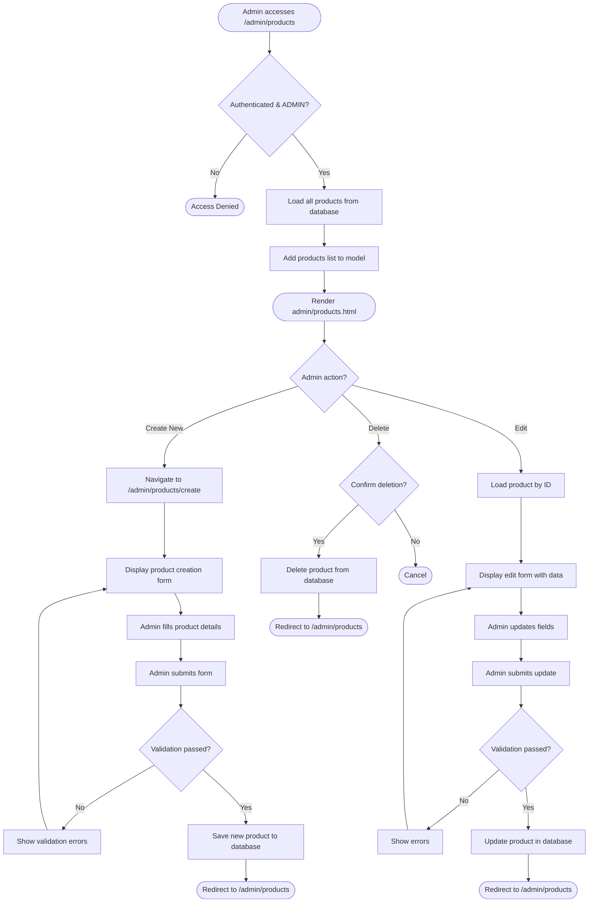

**Key Features:**
- CRUD operations for products
- Form validation on create/update
- Confirmation for delete operations

---

### 5.3 Order Management & Account Management

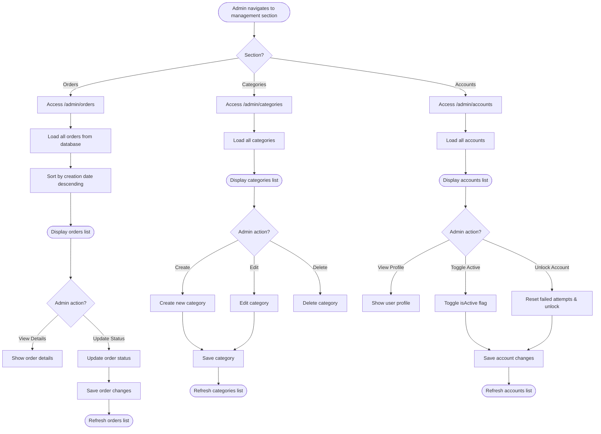

**Key Features:**
- Centralized admin control panel
- Order status management
- Category CRUD operations
- Account activation/deactivation
- Manual account unlock capability

---

## 6. Shopping Flows

### 6.1 Browse Products & View Details

```mermaid
flowchart TD
    Start([User accesses /products]) --> LoadProducts[Load products from database]
    LoadProducts --> ApplyFilters{Filters applied?}
    ApplyFilters -->|Yes| FilterByCategory[Filter by category]
    FilterByCategory --> FilterByPrice[Filter by price range]
    FilterByPrice --> FilterBySearch[Filter by search keyword]
    FilterBySearch --> SortResults[Sort results]
    ApplyFilters -->|No| SortResults
    SortResults --> Paginate[Paginate results]
    Paginate --> DisplayGrid([Display product grid])
    
    DisplayGrid --> UserClick{User clicks product?}
    UserClick -->|Yes| NavigateDetail[Navigate to /product/{id}]
    UserClick -->|No| BrowseMore[Continue browsing]
    
    NavigateDetail --> LoadProductDetail[Load product by ID]
    LoadProductDetail --> ProductExists{Product found?}
    ProductExists -->|No| Show404([Show 404 error])
    ProductExists -->|Yes| LoadImages[Load product images]
    LoadImages --> LoadReviews[Load product reviews]
    LoadReviews --> LoadRelated[Load related products]
    LoadRelated --> DisplayDetail([Display product detail page])
    DisplayDetail --> UserDetailAction{User action?}
    UserDetailAction -->|Add to Cart| AddToCart[Add item to cart]
    UserDetailAction -->|View Another| NavigateDetail
    UserDetailAction -->|Go Back| DisplayGrid
```

**Key Features:**
- Multi-criteria filtering (category, price, search)
- Pagination for performance
- Related products recommendation
- Product reviews display

---

### 6.2 Shopping Cart & Checkout

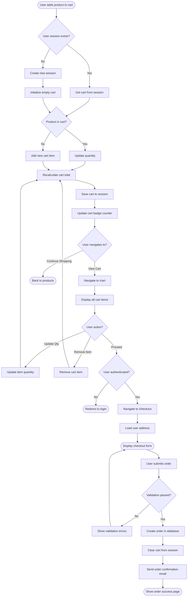

**Key Features:**
- Session-based cart management
- Real-time quantity updates
- Cart total recalculation
- Authentication requirement for checkout
- Order confirmation email
- Cart persistence across pages

---

## Summary

This document contains comprehensive activity diagrams for the ShopOMG e-commerce application featuring:

- **Authentication System**: Login with attempt limiting, registration with email verification, OAuth2 social login
- **Email Verification**: Token-based email verification and resend functionality
- **Password Reset**: Secure password reset flow with token expiration
- **Account Management**: Profile viewing and updating with avatar upload
- **Admin Features**: Dashboard, product management, order management, category and account administration
- **Shopping**: Product browsing, detailed views, cart management, and checkout

All flows include proper validation, error handling, security measures, and user feedback mechanisms.
