# Flow Hoạt Động - ShopOMG E-commerce

## 1. Tổng Quan Kiến Trúc

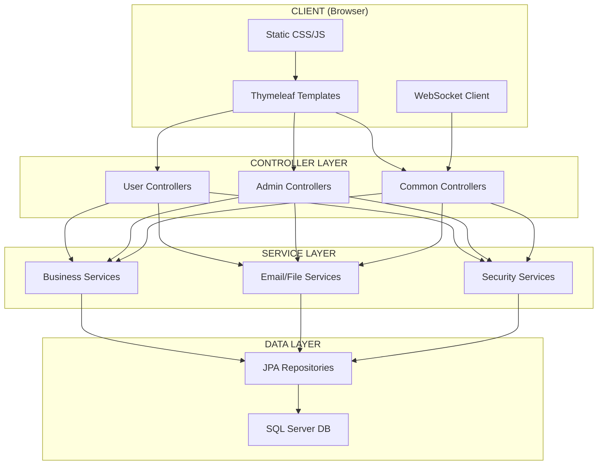

---

## 2. Request-Response Flow Chung

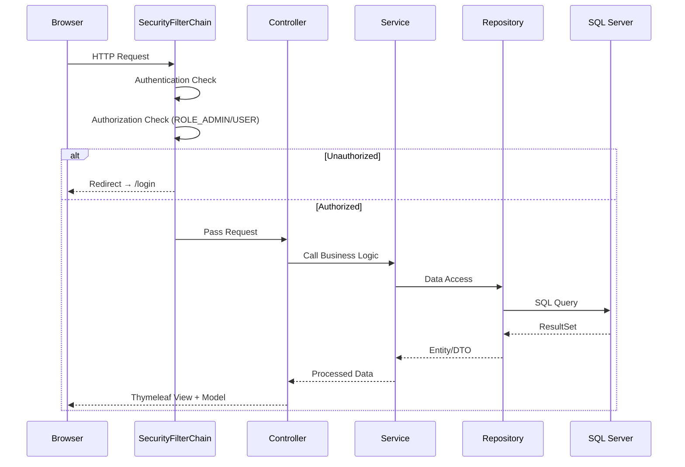

---

## 3. Flow Theo Từng Module

### 3.1 🏠 Trang Chủ / Duyệt Sản Phẩm

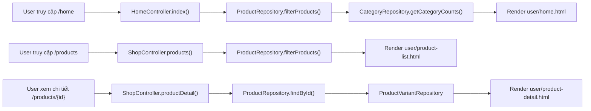

### 3.2 🔐 Đăng Ký / Đăng Nhập / OAuth2

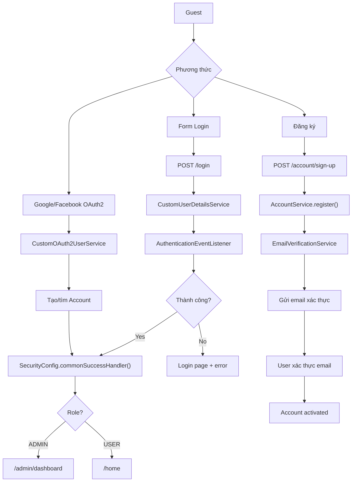

### 3.3 🛒 Giỏ Hàng → Thanh Toán

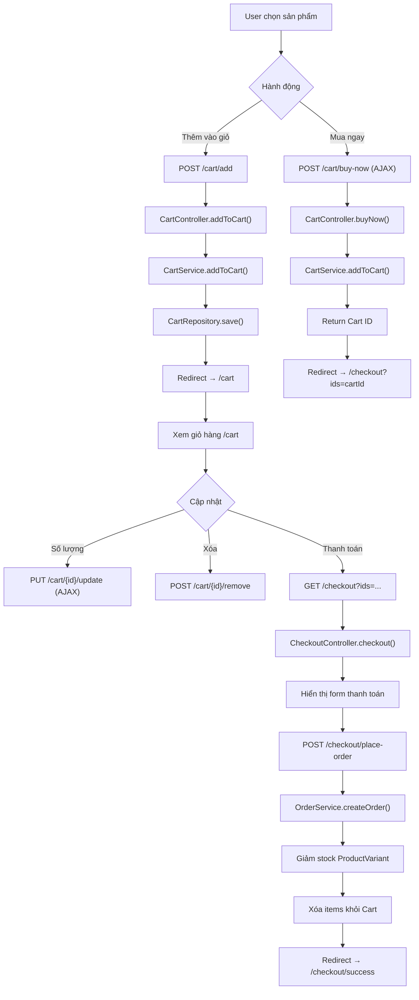

### 3.4 📦 Quản Lý Đơn Hàng (Admin)

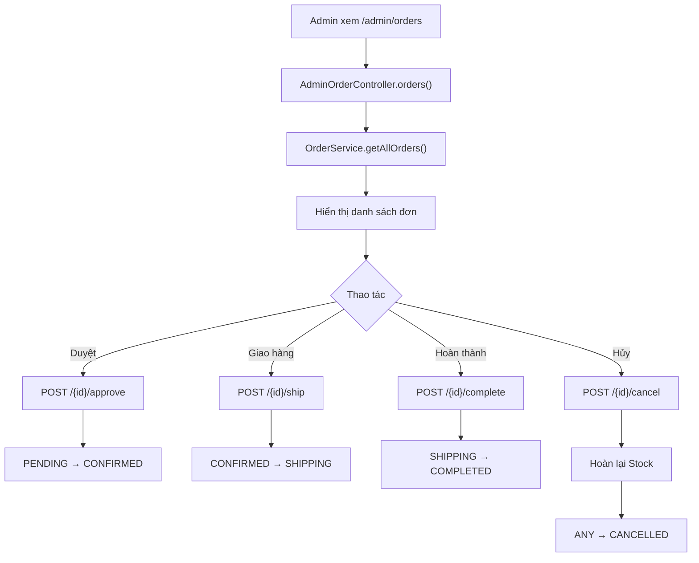

**State Machine - Trạng thái đơn hàng:**

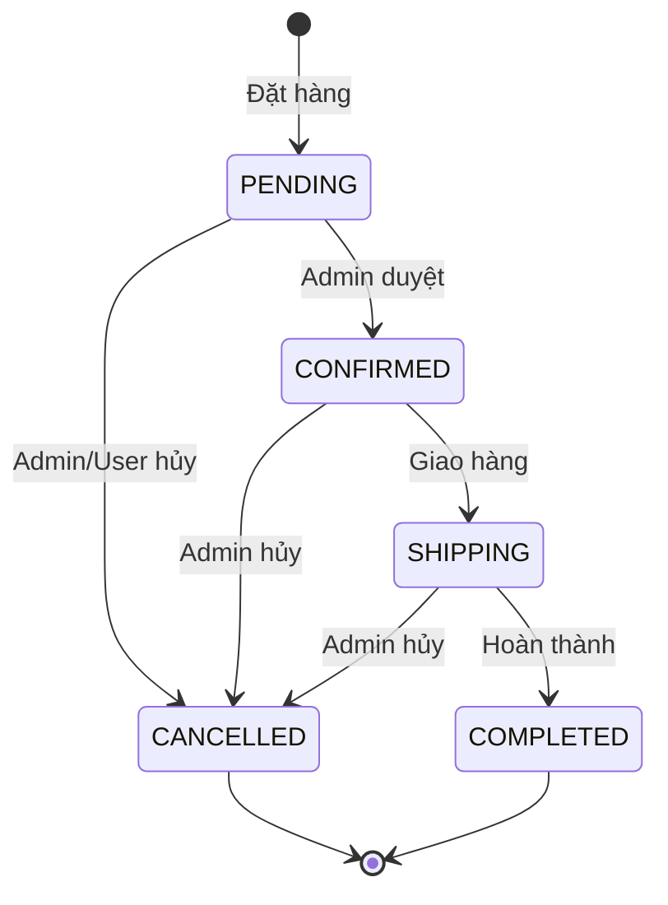

### 3.5 👤 Quản Lý Tài Khoản (User)

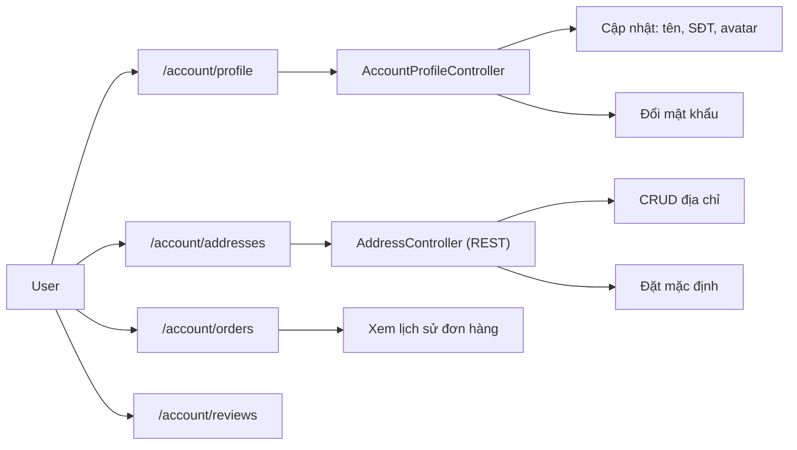

### 3.6 👨‍💼 Quản Lý Sản Phẩm (Admin)

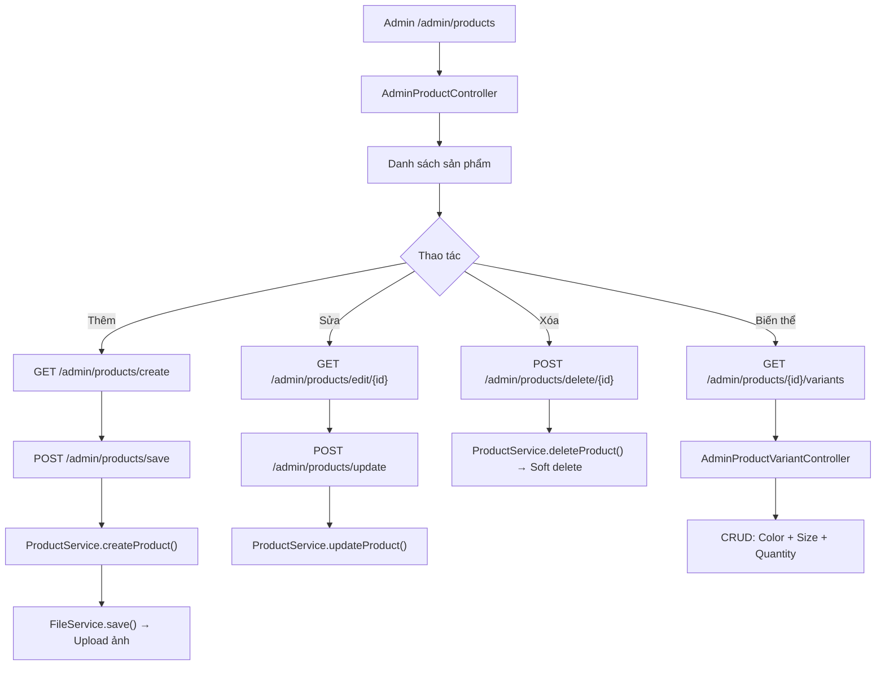

### 3.7 💬 Chat (WebSocket)

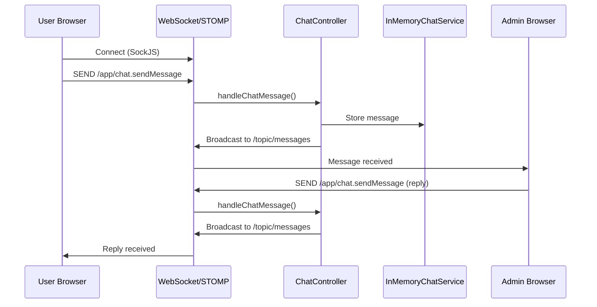

### 3.8 🔑 Quên / Đặt Lại Mật Khẩu

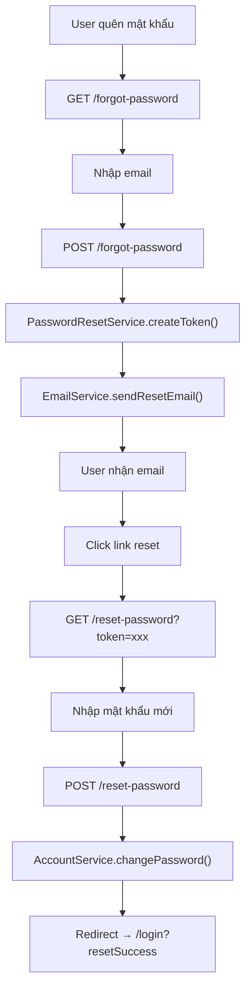

### 3.9 📊 Dashboard (Admin)

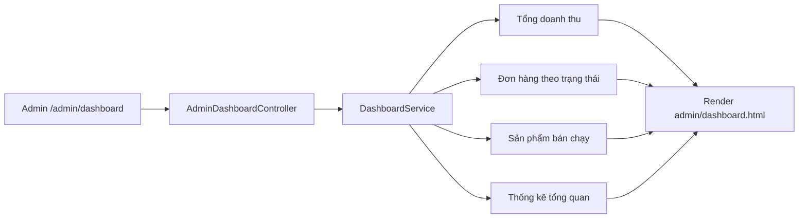

---

## 4. Tổng Hợp Endpoints

### User Endpoints

| Method | URL | Controller | Chức năng |
|--------|-----|-----------|-----------|
| GET | `/`, `/home` | HomeController | Trang chủ |
| GET | `/products` | ShopController | Danh sách sản phẩm |
| GET | `/products/{id}` | ShopController | Chi tiết sản phẩm |
| GET/POST | `/cart/**` | CartController | Giỏ hàng (CRUD) |
| GET/POST | `/checkout/**` | CheckoutController | Thanh toán |
| GET/POST | `/account/sign-up` | AccountAuthController | Đăng ký |
| GET/POST | `/login` | Spring Security | Đăng nhập |
| GET/POST | `/account/profile` | AccountProfileController | Hồ sơ cá nhân |
| REST | `/account/addresses/**` | AddressController | Địa chỉ |
| GET | `/account/orders` | AccountProfileController | Đơn hàng của tôi |
| GET/POST | `/forgot-password` | PasswordResetController | Quên mật khẩu |
| GET/POST | `/reset-password` | PasswordResetController | Đặt lại mật khẩu |
| GET | `/verify-email` | EmailVerificationController | Xác thực email |

### Admin Endpoints

| Method | URL | Controller | Chức năng |
|--------|-----|-----------|-----------|
| GET | `/admin/dashboard` | AdminDashboardController | Dashboard |
| GET/POST | `/admin/products/**` | AdminProductController | QL sản phẩm |
| GET/POST | `/admin/products/{id}/variants/**` | AdminProductVariantController | QL biến thể |
| GET/POST | `/admin/orders/**` | AdminOrderController | QL đơn hàng |
| GET/POST | `/admin/categories/**` | AdminCategoryController | QL danh mục |
| GET/POST | `/admin/accounts/**` | AdminAccountController | QL tài khoản |
| GET | `/admin/chat` | AdminChatController | Chat hỗ trợ |
