# Sequence Diagrams - Tất Cả Chức Năng ShopOMG

## Mục Lục

1. [Đăng ký tài khoản](#1-đăng-ký-tài-khoản)
2. [Đăng nhập (Form + OAuth2)](#2-đăng-nhập)
3. [Xác thực email](#3-xác-thực-email)
4. [Quên / Đặt lại mật khẩu](#4-quên--đặt-lại-mật-khẩu)
5. [Xem trang chủ / Lọc sản phẩm](#5-xem-trang-chủ--lọc-sản-phẩm)
6. [Xem chi tiết sản phẩm](#6-xem-chi-tiết-sản-phẩm)
7. [Thêm vào giỏ hàng](#7-thêm-vào-giỏ-hàng)
8. [Cập nhật giỏ hàng (AJAX)](#8-cập-nhật-giỏ-hàng-ajax)
9. [Mua ngay (Buy Now)](#9-mua-ngay-buy-now)
10. [Thanh toán (Checkout)](#10-thanh-toán-checkout)
11. [Cập nhật hồ sơ](#11-cập-nhật-hồ-sơ)
12. [Quản lý địa chỉ (CRUD)](#12-quản-lý-địa-chỉ-crud)
13. [Xem đơn hàng (User)](#13-xem-đơn-hàng-user)
14. [Admin - Dashboard](#14-admin---dashboard)
15. [Admin - CRUD sản phẩm](#15-admin---crud-sản-phẩm)
16. [Admin - Quản lý biến thể sản phẩm](#16-admin---quản-lý-biến-thể-sản-phẩm)
17. [Admin - Duyệt / Xử lý đơn hàng](#17-admin---duyệt--xử-lý-đơn-hàng)
18. [Admin - Hủy đơn hàng](#18-admin---hủy-đơn-hàng)
19. [Admin - Quản lý tài khoản](#19-admin---quản-lý-tài-khoản)
20. [Admin - Quản lý danh mục](#20-admin---quản-lý-danh-mục)
21. [Chat (WebSocket)](#21-chat-websocket)
22. [Admin - Export Excel](#22-admin---export-excel)

---

## 1. Đăng Ký Tài Khoản

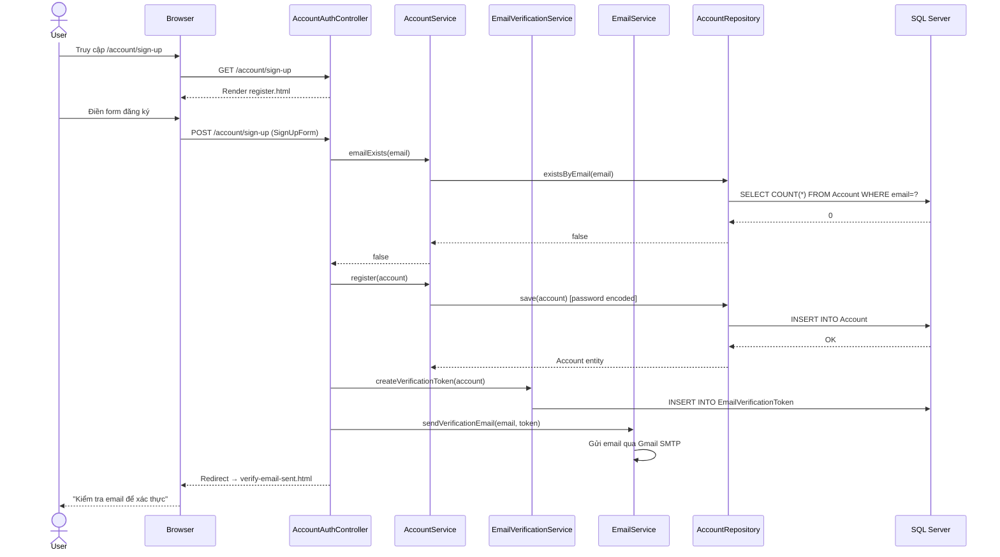
```mermaid
sequenceDiagram
    actor U as User
    participant B as Browser
    participant AC as AccountAuthController
    participant AS as AccountService
    participant EVS as EmailVerificationService
    participant ES as EmailService
    participant AR as AccountRepository
    participant DB as SQL Server

    U->>B: Truy cập /account/sign-up
    B->>AC: GET /account/sign-up
    AC-->>B: Render register.html

    U->>B: Điền form đăng ký
    B->>AC: POST /account/sign-up (SignUpForm)
    
    AC->>AS: emailExists(email)
    AS->>AR: existsByEmail(email)
    AR->>DB: SELECT COUNT(*) FROM Account WHERE email=?
    DB-->>AR: 0
    AR-->>AS: false
    AS-->>AC: false
    
    AC->>AS: register(account)
    AS->>AR: save(account) [password encoded]
    AR->>DB: INSERT INTO Account
    DB-->>AR: OK
    AR-->>AS: Account entity
    
    AC->>EVS: createVerificationToken(account)
    EVS->>DB: INSERT INTO EmailVerificationToken
    
    AC->>ES: sendVerificationEmail(email, token)
    ES->>ES: Gửi email qua Gmail SMTP
    
    AC-->>B: Redirect → verify-email-sent.html
    B-->>U: "Kiểm tra email để xác thực"
```

---

## 2. Đăng Nhập

### 2.1 Form Login

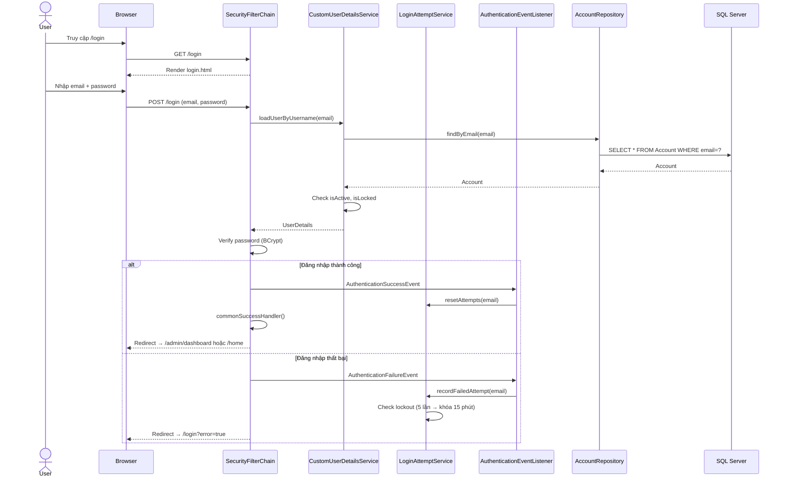
```mermaid
sequenceDiagram
    actor U as User
    participant B as Browser
    participant SF as SecurityFilterChain
    participant CUDS as CustomUserDetailsService
    participant LAS as LoginAttemptService
    participant AEL as AuthenticationEventListener
    participant AR as AccountRepository
    participant DB as SQL Server

    U->>B: Truy cập /login
    B->>SF: GET /login
    SF-->>B: Render login.html

    U->>B: Nhập email + password
    B->>SF: POST /login (email, password)
    
    SF->>CUDS: loadUserByUsername(email)
    CUDS->>AR: findByEmail(email)
    AR->>DB: SELECT * FROM Account WHERE email=?
    DB-->>AR: Account
    AR-->>CUDS: Account
    CUDS->>CUDS: Check isActive, isLocked
    CUDS-->>SF: UserDetails
    
    SF->>SF: Verify password (BCrypt)
    
    alt Đăng nhập thành công
        SF->>AEL: AuthenticationSuccessEvent
        AEL->>LAS: resetAttempts(email)
        SF->>SF: commonSuccessHandler()
        SF-->>B: Redirect → /admin/dashboard hoặc /home
    else Đăng nhập thất bại
        SF->>AEL: AuthenticationFailureEvent
        AEL->>LAS: recordFailedAttempt(email)
        LAS->>LAS: Check lockout (5 lần → khóa 15 phút)
        SF-->>B: Redirect → /login?error=true
    end
```

### 2.2 OAuth2 Login (Google/Facebook)

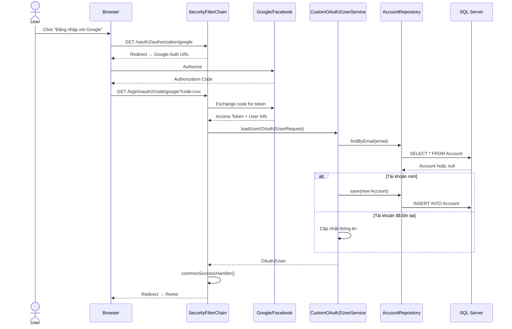
```mermaid
sequenceDiagram
    actor U as User
    participant B as Browser
    participant SF as SecurityFilterChain
    participant OAuth as Google/Facebook
    participant COUS as CustomOAuth2UserService
    participant AR as AccountRepository
    participant DB as SQL Server

    U->>B: Click "Đăng nhập với Google"
    B->>SF: GET /oauth2/authorization/google
    SF-->>B: Redirect → Google Auth URL
    B->>OAuth: Authorize
    OAuth-->>B: Authorization Code
    B->>SF: GET /login/oauth2/code/google?code=xxx
    SF->>OAuth: Exchange code for token
    OAuth-->>SF: Access Token + User Info
    
    SF->>COUS: loadUser(OAuth2UserRequest)
    COUS->>AR: findByEmail(email)
    AR->>DB: SELECT * FROM Account
    DB-->>AR: Account hoặc null
    
    alt Tài khoản mới
        COUS->>AR: save(new Account)
        AR->>DB: INSERT INTO Account
    else Tài khoản đã tồn tại
        COUS->>COUS: Cập nhật thông tin
    end
    
    COUS-->>SF: OAuth2User
    SF->>SF: commonSuccessHandler()
    SF-->>B: Redirect → /home
```

---

## 3. Xác Thực Email

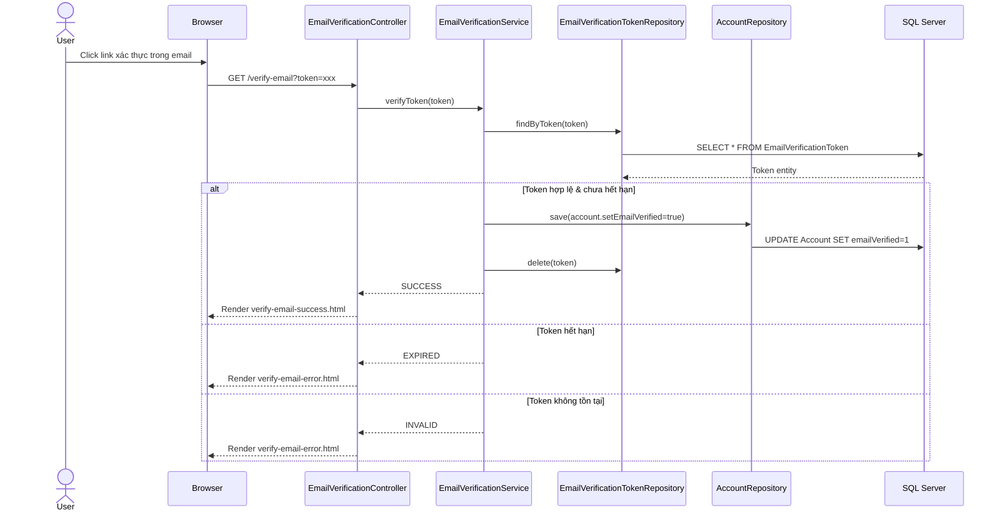
```mermaid
sequenceDiagram
    actor U as User
    participant B as Browser
    participant EVC as EmailVerificationController
    participant EVS as EmailVerificationService
    participant TR as EmailVerificationTokenRepository
    participant AR as AccountRepository
    participant DB as SQL Server

    U->>B: Click link xác thực trong email
    B->>EVC: GET /verify-email?token=xxx
    
    EVC->>EVS: verifyToken(token)
    EVS->>TR: findByToken(token)
    TR->>DB: SELECT * FROM EmailVerificationToken
    DB-->>TR: Token entity
    
    alt Token hợp lệ & chưa hết hạn
        EVS->>AR: save(account.setEmailVerified=true)
        AR->>DB: UPDATE Account SET emailVerified=1
        EVS->>TR: delete(token)
        EVS-->>EVC: SUCCESS
        EVC-->>B: Render verify-email-success.html
    else Token hết hạn
        EVS-->>EVC: EXPIRED
        EVC-->>B: Render verify-email-error.html
    else Token không tồn tại
        EVS-->>EVC: INVALID
        EVC-->>B: Render verify-email-error.html
    end
```

---

## 4. Quên / Đặt Lại Mật Khẩu

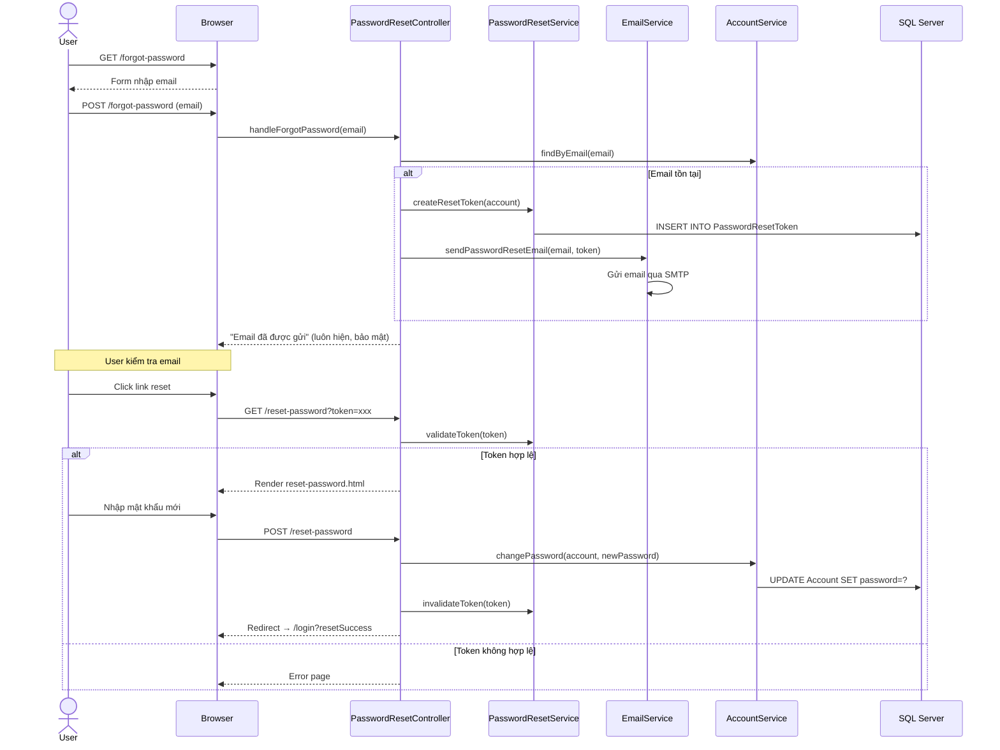
```mermaid
sequenceDiagram
    actor U as User
    participant B as Browser
    participant PRC as PasswordResetController
    participant PRS as PasswordResetService
    participant ES as EmailService
    participant AS as AccountService
    participant DB as SQL Server

    U->>B: GET /forgot-password
    B-->>U: Form nhập email

    U->>B: POST /forgot-password (email)
    B->>PRC: handleForgotPassword(email)
    PRC->>AS: findByEmail(email)
    
    alt Email tồn tại
        PRC->>PRS: createResetToken(account)
        PRS->>DB: INSERT INTO PasswordResetToken
        PRC->>ES: sendPasswordResetEmail(email, token)
        ES->>ES: Gửi email qua SMTP
    end
    PRC-->>B: "Email đã được gửi" (luôn hiện, bảo mật)

    Note over U,B: User kiểm tra email

    U->>B: Click link reset
    B->>PRC: GET /reset-password?token=xxx
    PRC->>PRS: validateToken(token)
    
    alt Token hợp lệ
        PRC-->>B: Render reset-password.html
        U->>B: Nhập mật khẩu mới
        B->>PRC: POST /reset-password
        PRC->>AS: changePassword(account, newPassword)
        AS->>DB: UPDATE Account SET password=?
        PRC->>PRS: invalidateToken(token)
        PRC-->>B: Redirect → /login?resetSuccess
    else Token không hợp lệ
        PRC-->>B: Error page
    end
```

---

## 5. Xem Trang Chủ / Lọc Sản Phẩm

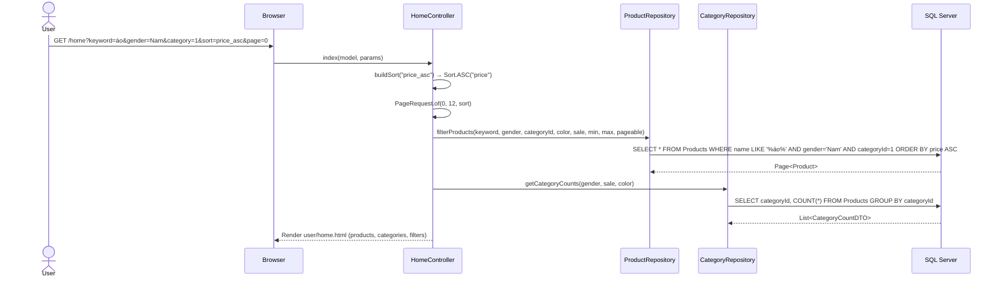
```mermaid
sequenceDiagram
    actor U as User
    participant B as Browser
    participant HC as HomeController
    participant PR as ProductRepository
    participant CR as CategoryRepository
    participant DB as SQL Server

    U->>B: GET /home?keyword=áo&gender=Nam&category=1&sort=price_asc&page=0
    B->>HC: index(model, params)
    
    HC->>HC: buildSort("price_asc") → Sort.ASC("price")
    HC->>HC: PageRequest.of(0, 12, sort)
    
    HC->>PR: filterProducts(keyword, gender, categoryId, color, sale, min, max, pageable)
    PR->>DB: SELECT * FROM Products WHERE name LIKE '%áo%' AND gender='Nam' AND categoryId=1 ORDER BY price ASC
    DB-->>PR: Page<Product>
    
    HC->>CR: getCategoryCounts(gender, sale, color)
    CR->>DB: SELECT categoryId, COUNT(*) FROM Products GROUP BY categoryId
    DB-->>CR: List<CategoryCountDTO>
    
    HC-->>B: Render user/home.html (products, categories, filters)
```

---

## 6. Xem Chi Tiết Sản Phẩm

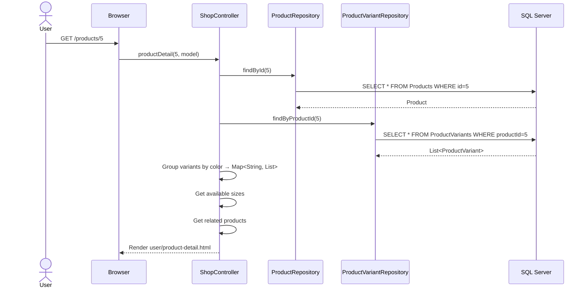
```mermaid
sequenceDiagram
    actor U as User
    participant B as Browser
    participant SC as ShopController
    participant PR as ProductRepository
    participant PVR as ProductVariantRepository
    participant DB as SQL Server

    U->>B: GET /products/5
    B->>SC: productDetail(5, model)
    
    SC->>PR: findById(5)
    PR->>DB: SELECT * FROM Products WHERE id=5
    DB-->>PR: Product
    
    SC->>PVR: findByProductId(5)
    PVR->>DB: SELECT * FROM ProductVariants WHERE productId=5
    DB-->>PVR: List<ProductVariant>
    
    SC->>SC: Group variants by color → Map<String, List>
    SC->>SC: Get available sizes
    SC->>SC: Get related products
    
    SC-->>B: Render user/product-detail.html
```

---

## 7. Thêm Vào Giỏ Hàng

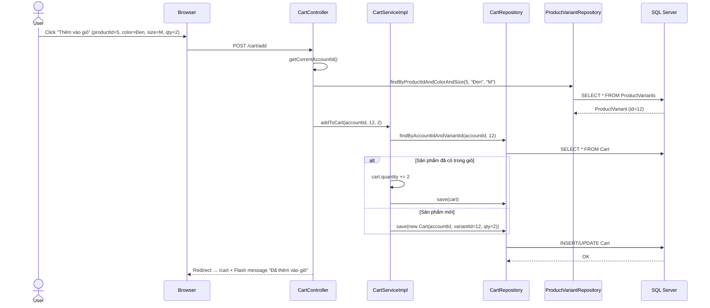
```mermaid
sequenceDiagram
    actor U as User
    participant B as Browser
    participant CC as CartController
    participant CS as CartServiceImpl
    participant CR as CartRepository
    participant PVR as ProductVariantRepository
    participant DB as SQL Server

    U->>B: Click "Thêm vào giỏ" (productId=5, color=Đen, size=M, qty=2)
    B->>CC: POST /cart/add

    CC->>CC: getCurrentAccountId()
    CC->>PVR: findByProductIdAndColorAndSize(5, "Đen", "M")
    PVR->>DB: SELECT * FROM ProductVariants
    DB-->>PVR: ProductVariant (id=12)

    CC->>CS: addToCart(accountId, 12, 2)
    CS->>CR: findByAccountIdAndVariantId(accountId, 12)
    CR->>DB: SELECT * FROM Cart
    
    alt Sản phẩm đã có trong giỏ
        CS->>CS: cart.quantity += 2
        CS->>CR: save(cart)
    else Sản phẩm mới
        CS->>CR: save(new Cart(accountId, variantId=12, qty=2))
    end
    
    CR->>DB: INSERT/UPDATE Cart
    DB-->>CR: OK
    
    CC-->>B: Redirect → /cart + Flash message "Đã thêm vào giỏ"
```

---

## 8. Cập Nhật Giỏ Hàng (AJAX)

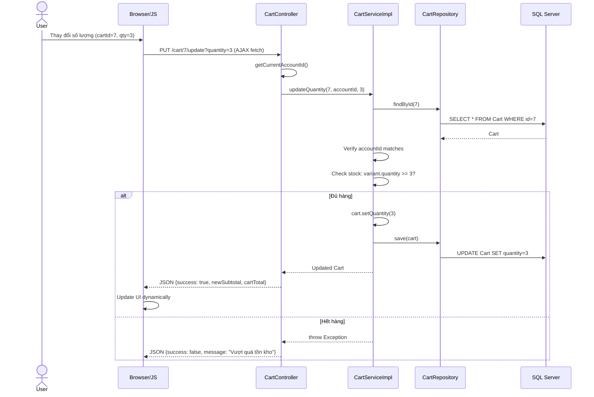
```mermaid
sequenceDiagram
    actor U as User
    participant B as Browser/JS
    participant CC as CartController
    participant CS as CartServiceImpl
    participant CR as CartRepository
    participant DB as SQL Server

    U->>B: Thay đổi số lượng (cartId=7, qty=3)
    B->>CC: PUT /cart/7/update?quantity=3 (AJAX fetch)
    
    CC->>CC: getCurrentAccountId()
    CC->>CS: updateQuantity(7, accountId, 3)
    
    CS->>CR: findById(7)
    CR->>DB: SELECT * FROM Cart WHERE id=7
    DB-->>CR: Cart

    CS->>CS: Verify accountId matches
    CS->>CS: Check stock: variant.quantity >= 3?
    
    alt Đủ hàng
        CS->>CS: cart.setQuantity(3)
        CS->>CR: save(cart)
        CR->>DB: UPDATE Cart SET quantity=3
        CS-->>CC: Updated Cart
        CC-->>B: JSON {success: true, newSubtotal, cartTotal}
        B->>B: Update UI dynamically
    else Hết hàng
        CS-->>CC: throw Exception
        CC-->>B: JSON {success: false, message: "Vượt quá tồn kho"}
    end
```

---

## 9. Mua Ngay (Buy Now)

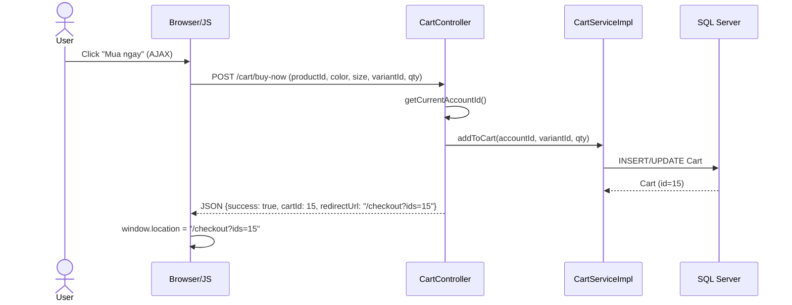
```mermaid
sequenceDiagram
    actor U as User
    participant B as Browser/JS
    participant CC as CartController
    participant CS as CartServiceImpl
    participant DB as SQL Server

    U->>B: Click "Mua ngay" (AJAX)
    B->>CC: POST /cart/buy-now (productId, color, size, variantId, qty)
    
    CC->>CC: getCurrentAccountId()
    CC->>CS: addToCart(accountId, variantId, qty)
    CS->>DB: INSERT/UPDATE Cart
    DB-->>CS: Cart (id=15)
    
    CC-->>B: JSON {success: true, cartId: 15, redirectUrl: "/checkout?ids=15"}
    B->>B: window.location = "/checkout?ids=15"
```

---

## 10. Thanh Toán (Checkout)

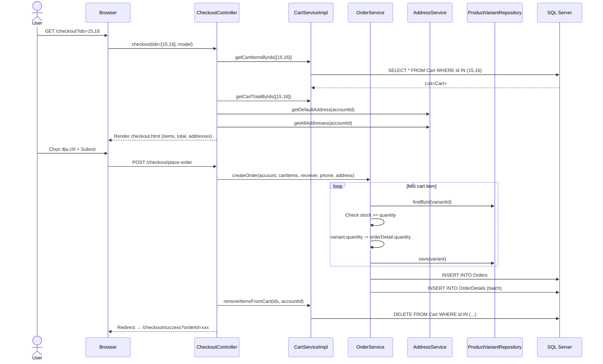
```mermaid
sequenceDiagram
    actor U as User
    participant B as Browser
    participant ChC as CheckoutController
    participant CS as CartServiceImpl
    participant OS as OrderService
    participant AS as AddressService
    participant PVR as ProductVariantRepository
    participant DB as SQL Server

    U->>B: GET /checkout?ids=15,16
    B->>ChC: checkout(ids=[15,16], model)
    
    ChC->>CS: getCartItemsByIds([15,16])
    CS->>DB: SELECT * FROM Cart WHERE id IN (15,16)
    DB-->>CS: List<Cart>
    
    ChC->>CS: getCartTotalByIds([15,16])
    ChC->>AS: getDefaultAddress(accountId)
    ChC->>AS: getAllAddresses(accountId)
    
    ChC-->>B: Render checkout.html (items, total, addresses)

    U->>B: Chọn địa chỉ + Submit
    B->>ChC: POST /checkout/place-order

    ChC->>OS: createOrder(account, cartItems, receiver, phone, address)
    
    loop Mỗi cart item
        OS->>PVR: findById(variantId)
        OS->>OS: Check stock >= quantity
        OS->>OS: variant.quantity -= orderDetail.quantity
        OS->>PVR: save(variant)
    end
    
    OS->>DB: INSERT INTO Orders
    OS->>DB: INSERT INTO OrderDetails (batch)
    
    ChC->>CS: removeItemsFromCart(ids, accountId)
    CS->>DB: DELETE FROM Cart WHERE id IN (...)
    
    ChC-->>B: Redirect → /checkout/success?orderId=xxx
```

---

## 11. Cập Nhật Hồ Sơ

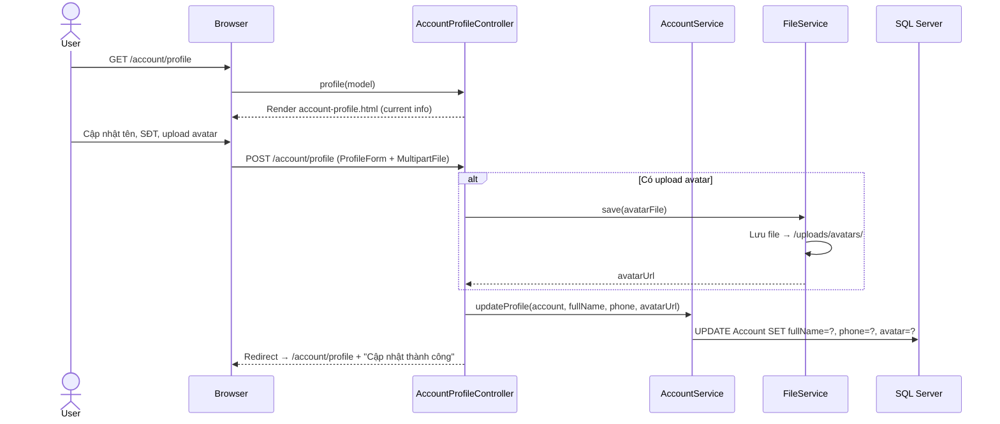
```mermaid
sequenceDiagram
    actor U as User
    participant B as Browser
    participant APC as AccountProfileController
    participant AS as AccountService
    participant FS as FileService
    participant DB as SQL Server

    U->>B: GET /account/profile
    B->>APC: profile(model)
    APC-->>B: Render account-profile.html (current info)

    U->>B: Cập nhật tên, SĐT, upload avatar
    B->>APC: POST /account/profile (ProfileForm + MultipartFile)
    
    alt Có upload avatar
        APC->>FS: save(avatarFile)
        FS->>FS: Lưu file → /uploads/avatars/
        FS-->>APC: avatarUrl
    end
    
    APC->>AS: updateProfile(account, fullName, phone, avatarUrl)
    AS->>DB: UPDATE Account SET fullName=?, phone=?, avatar=?
    
    APC-->>B: Redirect → /account/profile + "Cập nhật thành công"
```

---

## 12. Quản Lý Địa Chỉ (CRUD)

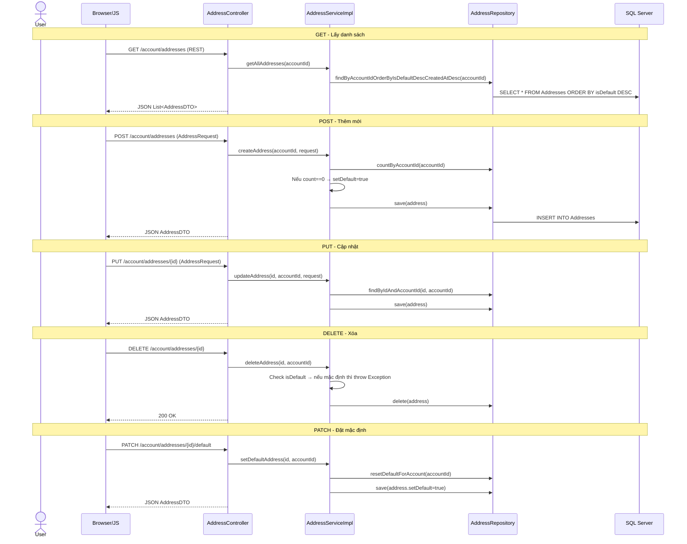
```mermaid
sequenceDiagram
    actor U as User
    participant B as Browser/JS
    participant AC as AddressController
    participant AS as AddressServiceImpl
    participant AR as AddressRepository
    participant DB as SQL Server

    Note over U,DB: GET - Lấy danh sách
    B->>AC: GET /account/addresses (REST)
    AC->>AS: getAllAddresses(accountId)
    AS->>AR: findByAccountIdOrderByIsDefaultDescCreatedAtDesc(accountId)
    AR->>DB: SELECT * FROM Addresses ORDER BY isDefault DESC
    AC-->>B: JSON List<AddressDTO>

    Note over U,DB: POST - Thêm mới
    B->>AC: POST /account/addresses (AddressRequest)
    AC->>AS: createAddress(accountId, request)
    AS->>AR: countByAccountId(accountId)
    AS->>AS: Nếu count==0 → setDefault=true
    AS->>AR: save(address)
    AR->>DB: INSERT INTO Addresses
    AC-->>B: JSON AddressDTO

    Note over U,DB: PUT - Cập nhật
    B->>AC: PUT /account/addresses/{id} (AddressRequest)
    AC->>AS: updateAddress(id, accountId, request)
    AS->>AR: findByIdAndAccountId(id, accountId)
    AS->>AR: save(address)
    AC-->>B: JSON AddressDTO

    Note over U,DB: DELETE - Xóa
    B->>AC: DELETE /account/addresses/{id}
    AC->>AS: deleteAddress(id, accountId)
    AS->>AS: Check isDefault → nếu mặc định thì throw Exception
    AS->>AR: delete(address)
    AC-->>B: 200 OK

    Note over U,DB: PATCH - Đặt mặc định
    B->>AC: PATCH /account/addresses/{id}/default
    AC->>AS: setDefaultAddress(id, accountId)
    AS->>AR: resetDefaultForAccount(accountId)
    AS->>AR: save(address.setDefault=true)
    AC-->>B: JSON AddressDTO
```

---

## 13. Xem Đơn Hàng (User)

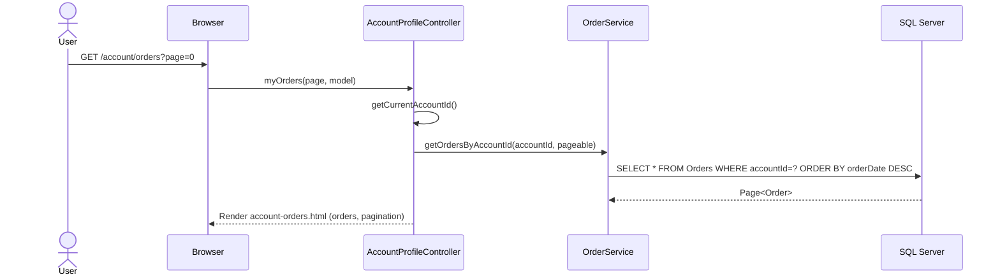
```mermaid
sequenceDiagram
    actor U as User
    participant B as Browser
    participant APC as AccountProfileController
    participant OS as OrderService
    participant DB as SQL Server

    U->>B: GET /account/orders?page=0
    B->>APC: myOrders(page, model)
    
    APC->>APC: getCurrentAccountId()
    APC->>OS: getOrdersByAccountId(accountId, pageable)
    OS->>DB: SELECT * FROM Orders WHERE accountId=? ORDER BY orderDate DESC
    DB-->>OS: Page<Order>
    
    APC-->>B: Render account-orders.html (orders, pagination)
```

---

## 14. Admin - Dashboard

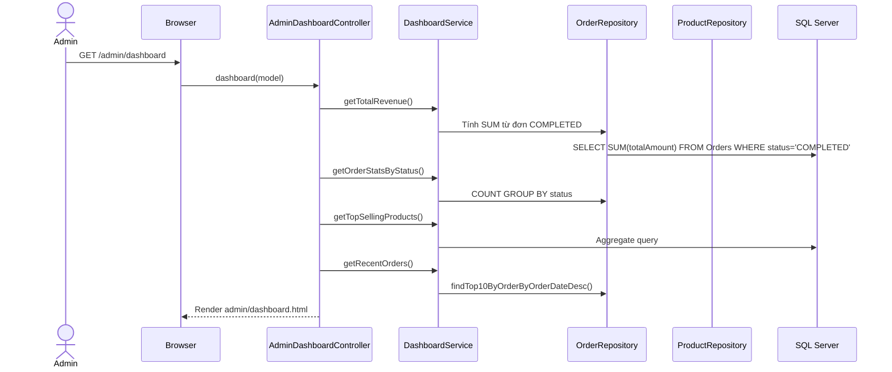
```mermaid
sequenceDiagram
    actor A as Admin
    participant B as Browser
    participant ADC as AdminDashboardController
    participant DS as DashboardService
    participant OR as OrderRepository
    participant PR as ProductRepository
    participant DB as SQL Server

    A->>B: GET /admin/dashboard
    B->>ADC: dashboard(model)
    
    ADC->>DS: getTotalRevenue()
    DS->>OR: Tính SUM từ đơn COMPLETED
    OR->>DB: SELECT SUM(totalAmount) FROM Orders WHERE status='COMPLETED'
    
    ADC->>DS: getOrderStatsByStatus()
    DS->>OR: COUNT GROUP BY status
    
    ADC->>DS: getTopSellingProducts()
    DS->>DB: Aggregate query
    
    ADC->>DS: getRecentOrders()
    DS->>OR: findTop10ByOrderByOrderDateDesc()
    
    ADC-->>B: Render admin/dashboard.html
```

---

## 15. Admin - CRUD Sản Phẩm

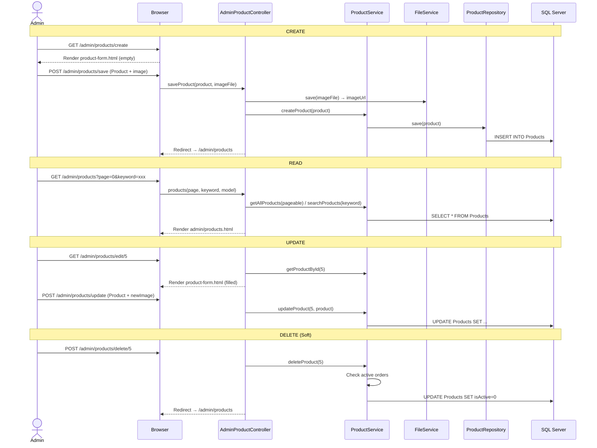
```mermaid
sequenceDiagram
    actor A as Admin
    participant B as Browser
    participant APC as AdminProductController
    participant PS as ProductService
    participant FS as FileService
    participant PR as ProductRepository
    participant DB as SQL Server

    Note over A,DB: CREATE
    A->>B: GET /admin/products/create
    B-->>A: Render product-form.html (empty)
    A->>B: POST /admin/products/save (Product + image)
    B->>APC: saveProduct(product, imageFile)
    APC->>FS: save(imageFile) → imageUrl
    APC->>PS: createProduct(product)
    PS->>PR: save(product)
    PR->>DB: INSERT INTO Products
    APC-->>B: Redirect → /admin/products

    Note over A,DB: READ
    A->>B: GET /admin/products?page=0&keyword=xxx
    B->>APC: products(page, keyword, model)
    APC->>PS: getAllProducts(pageable) / searchProducts(keyword)
    PS->>DB: SELECT * FROM Products
    APC-->>B: Render admin/products.html

    Note over A,DB: UPDATE
    A->>B: GET /admin/products/edit/5
    APC->>PS: getProductById(5)
    APC-->>B: Render product-form.html (filled)
    A->>B: POST /admin/products/update (Product + newImage)
    APC->>PS: updateProduct(5, product)
    PS->>DB: UPDATE Products SET ...

    Note over A,DB: DELETE (Soft)
    A->>B: POST /admin/products/delete/5
    APC->>PS: deleteProduct(5)
    PS->>PS: Check active orders
    PS->>DB: UPDATE Products SET isActive=0
    APC-->>B: Redirect → /admin/products
```

---

## 16. Admin - Quản Lý Biến Thể Sản Phẩm

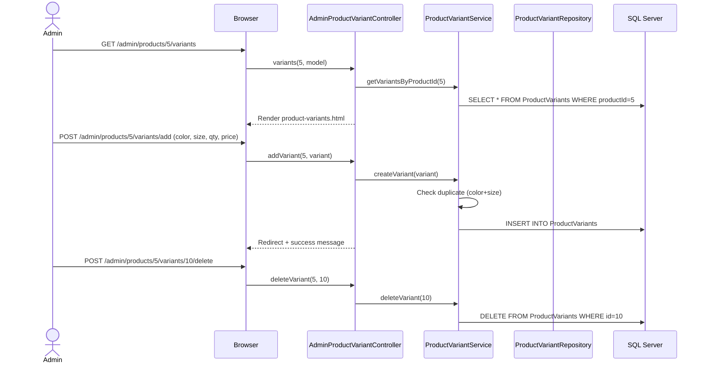
```mermaid
sequenceDiagram
    actor A as Admin
    participant B as Browser
    participant APVC as AdminProductVariantController
    participant PVS as ProductVariantService
    participant PVR as ProductVariantRepository
    participant DB as SQL Server

    A->>B: GET /admin/products/5/variants
    B->>APVC: variants(5, model)
    APVC->>PVS: getVariantsByProductId(5)
    PVS->>DB: SELECT * FROM ProductVariants WHERE productId=5
    APVC-->>B: Render product-variants.html

    A->>B: POST /admin/products/5/variants/add (color, size, qty, price)
    B->>APVC: addVariant(5, variant)
    APVC->>PVS: createVariant(variant)
    PVS->>PVS: Check duplicate (color+size)
    PVS->>DB: INSERT INTO ProductVariants
    APVC-->>B: Redirect + success message

    A->>B: POST /admin/products/5/variants/10/delete
    B->>APVC: deleteVariant(5, 10)
    APVC->>PVS: deleteVariant(10)
    PVS->>DB: DELETE FROM ProductVariants WHERE id=10
```

---

## 17. Admin - Duyệt / Xử Lý Đơn Hàng

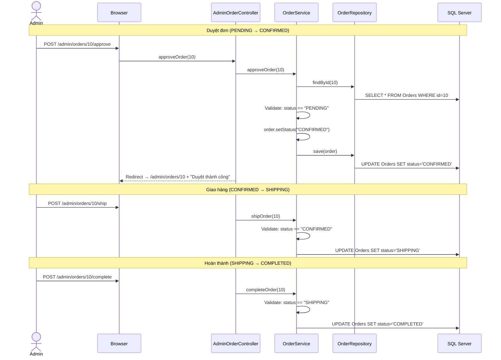
```mermaid
sequenceDiagram
    actor A as Admin
    participant B as Browser
    participant AOC as AdminOrderController
    participant OS as OrderService
    participant OR as OrderRepository
    participant DB as SQL Server

    Note over A,DB: Duyệt đơn (PENDING → CONFIRMED)
    A->>B: POST /admin/orders/10/approve
    B->>AOC: approveOrder(10)
    AOC->>OS: approveOrder(10)
    OS->>OR: findById(10)
    OR->>DB: SELECT * FROM Orders WHERE id=10
    OS->>OS: Validate: status == "PENDING"
    OS->>OS: order.setStatus("CONFIRMED")
    OS->>OR: save(order)
    OR->>DB: UPDATE Orders SET status='CONFIRMED'
    AOC-->>B: Redirect → /admin/orders/10 + "Duyệt thành công"

    Note over A,DB: Giao hàng (CONFIRMED → SHIPPING)
    A->>B: POST /admin/orders/10/ship
    AOC->>OS: shipOrder(10)
    OS->>OS: Validate: status == "CONFIRMED"
    OS->>DB: UPDATE Orders SET status='SHIPPING'

    Note over A,DB: Hoàn thành (SHIPPING → COMPLETED)
    A->>B: POST /admin/orders/10/complete
    AOC->>OS: completeOrder(10)
    OS->>OS: Validate: status == "SHIPPING"
    OS->>DB: UPDATE Orders SET status='COMPLETED'
```

---

## 18. Admin - Hủy Đơn Hàng

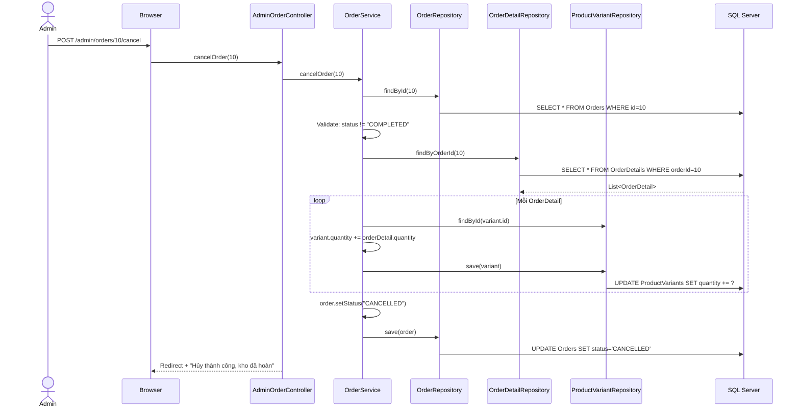
```mermaid
sequenceDiagram
    actor A as Admin
    participant B as Browser
    participant AOC as AdminOrderController
    participant OS as OrderService
    participant OR as OrderRepository
    participant ODR as OrderDetailRepository
    participant PVR as ProductVariantRepository
    participant DB as SQL Server

    A->>B: POST /admin/orders/10/cancel
    B->>AOC: cancelOrder(10)
    AOC->>OS: cancelOrder(10)
    
    OS->>OR: findById(10)
    OR->>DB: SELECT * FROM Orders WHERE id=10
    OS->>OS: Validate: status != "COMPLETED"
    
    OS->>ODR: findByOrderId(10)
    ODR->>DB: SELECT * FROM OrderDetails WHERE orderId=10
    DB-->>ODR: List<OrderDetail>

    loop Mỗi OrderDetail
        OS->>PVR: findById(variant.id)
        OS->>OS: variant.quantity += orderDetail.quantity
        OS->>PVR: save(variant)
        PVR->>DB: UPDATE ProductVariants SET quantity += ?
    end

    OS->>OS: order.setStatus("CANCELLED")
    OS->>OR: save(order)
    OR->>DB: UPDATE Orders SET status='CANCELLED'
    
    AOC-->>B: Redirect + "Hủy thành công, kho đã hoàn"
```

---

## 19. Admin - Quản Lý Tài Khoản

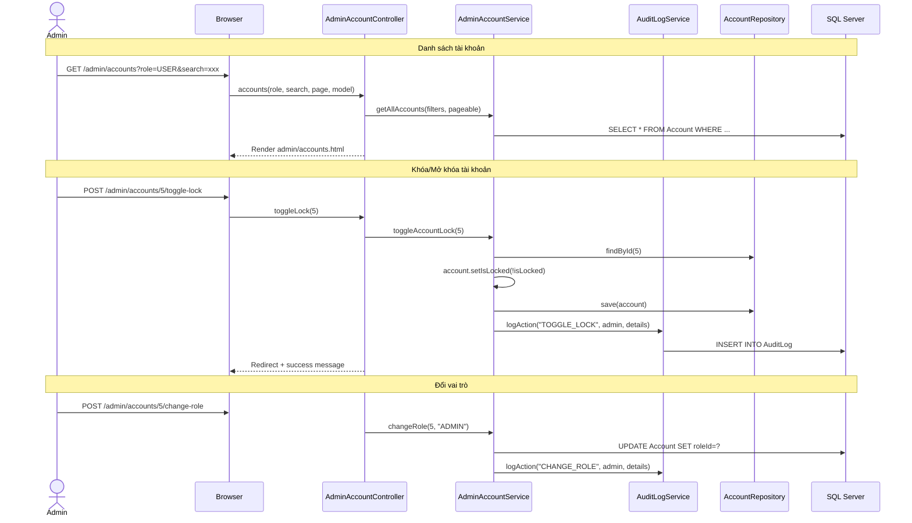
```mermaid
sequenceDiagram
    actor A as Admin
    participant B as Browser
    participant AAC as AdminAccountController
    participant AAS as AdminAccountService
    participant ALS as AuditLogService
    participant AR as AccountRepository
    participant DB as SQL Server

    Note over A,DB: Danh sách tài khoản
    A->>B: GET /admin/accounts?role=USER&search=xxx
    B->>AAC: accounts(role, search, page, model)
    AAC->>AAS: getAllAccounts(filters, pageable)
    AAS->>DB: SELECT * FROM Account WHERE ...
    AAC-->>B: Render admin/accounts.html

    Note over A,DB: Khóa/Mở khóa tài khoản
    A->>B: POST /admin/accounts/5/toggle-lock
    B->>AAC: toggleLock(5)
    AAC->>AAS: toggleAccountLock(5)
    AAS->>AR: findById(5)
    AAS->>AAS: account.setIsLocked(!isLocked)
    AAS->>AR: save(account)
    AAS->>ALS: logAction("TOGGLE_LOCK", admin, details)
    ALS->>DB: INSERT INTO AuditLog
    AAC-->>B: Redirect + success message

    Note over A,DB: Đổi vai trò
    A->>B: POST /admin/accounts/5/change-role
    AAC->>AAS: changeRole(5, "ADMIN")
    AAS->>DB: UPDATE Account SET roleId=?
    AAS->>ALS: logAction("CHANGE_ROLE", admin, details)
```

---

## 20. Admin - Quản Lý Danh Mục

```mermaid
sequenceDiagram
    actor A as Admin
    participant B as Browser
    participant ACC as AdminCategoryController
    participant CS as CategoryService
    participant CR as CategoryRepository
    participant DB as SQL Server

    A->>B: GET /admin/categories
    B->>ACC: categories(model)
    ACC->>CS: getAllCategories()
    CS->>DB: SELECT * FROM Categories
    ACC-->>B: Render admin/categories.html

    A->>B: POST /admin/categories/save (name)
    B->>ACC: saveCategory(category)
    ACC->>CS: createCategory(category)
    CS->>CR: save(category)
    CR->>DB: INSERT INTO Categories
    ACC-->>B: Redirect + success

    A->>B: POST /admin/categories/delete/3
    ACC->>CS: deleteCategory(3)
    CS->>CS: Check sản phẩm liên quan
    CS->>DB: DELETE FROM Categories WHERE id=3
```

---

## 21. Chat (WebSocket)

```mermaid
sequenceDiagram
    actor U as User
    actor A as Admin
    participant BWS as Browser WebSocket
    participant STOMP as STOMP Endpoint
    participant CC as ChatController
    participant ICS as InMemoryChatService

    U->>BWS: new SockJS("/ws")
    BWS->>STOMP: CONNECT

    U->>BWS: stompClient.send("/app/chat.sendMessage", message)
    BWS->>STOMP: SEND /app/chat.sendMessage
    STOMP->>CC: handleChatMessage(ChatMessage)
    CC->>ICS: storeMessage(message)
    CC->>STOMP: convertAndSend("/topic/messages", message)
    STOMP->>BWS: MESSAGE /topic/messages
    BWS->>A: Hiển thị tin nhắn

    A->>BWS: stompClient.send("/app/chat.sendMessage", reply)
    BWS->>STOMP: SEND /app/chat.sendMessage
    STOMP->>CC: handleChatMessage(reply)
    CC->>ICS: storeMessage(reply)
    CC->>STOMP: convertAndSend("/topic/messages", reply)
    STOMP->>BWS: MESSAGE /topic/messages
    BWS->>U: Hiển thị phản hồi
```

---

## 22. Admin - Export Excel

```mermaid
sequenceDiagram
    actor A as Admin
    participant B as Browser
    participant ADC as AdminDashboardController
    participant EES as ExcelExportService
    participant OR as OrderRepository

    A->>B: GET /admin/dashboard/export?type=orders&from=2024-01-01&to=2024-12-31
    B->>ADC: exportExcel(type, dateRange)
    
    ADC->>EES: exportOrders(startDate, endDate)
    EES->>OR: findByDateRange(start, end)
    OR-->>EES: List<Order>
    
    EES->>EES: Apache POI: Workbook → Sheet → Rows
    EES->>EES: Style headers, format data
    EES-->>ADC: ByteArrayOutputStream
    
    ADC-->>B: Response (Content-Type: application/vnd.openxmlformats...)
    B-->>A: Download file .xlsx
```
